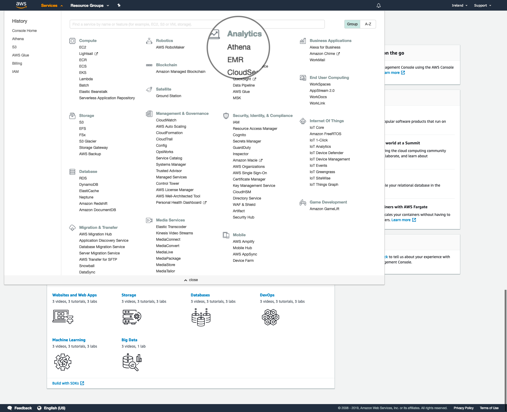
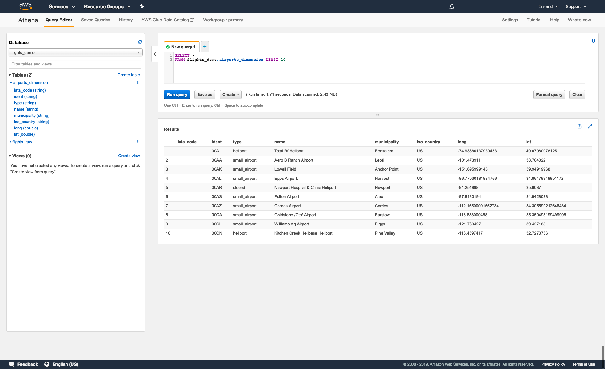
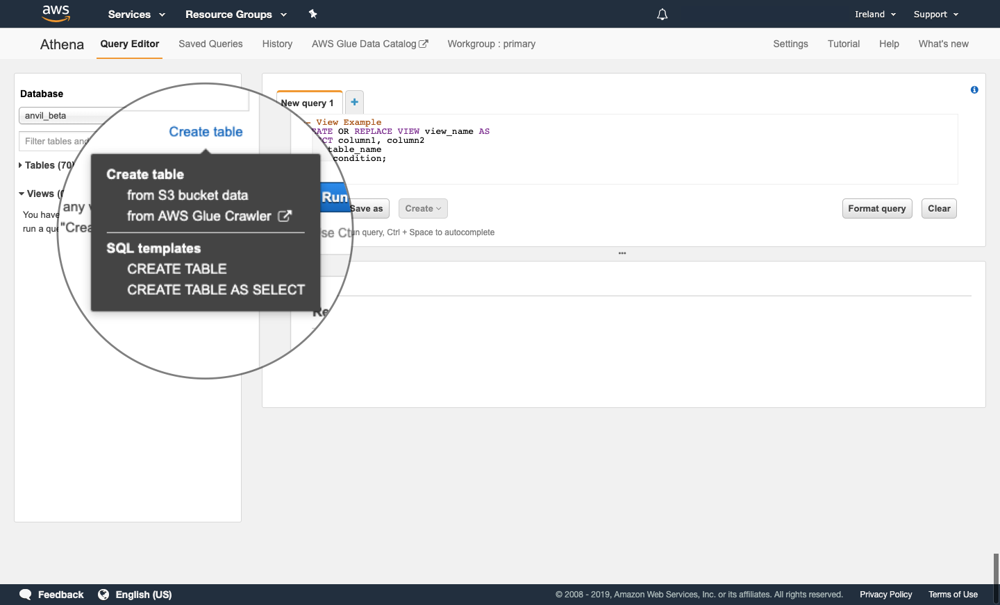
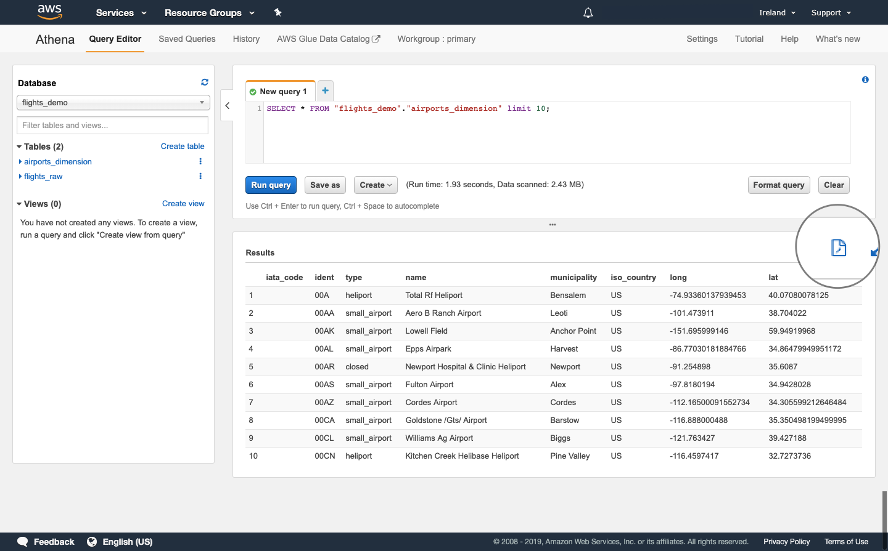

# Amazon Athena
> Amazon Athena is an interactive query service that makes it easy to analyze data directly in Amazon Simple Storage Service (Amazon S3) using standard SQL. With a few actions in the AWS Management Console, you can point Athena at your data stored in Amazon S3 and begin using standard SQL to run ad-hoc queries and get results in seconds.

> Source: [AWS](https://docs.aws.amazon.com/athena/latest/ug/what-is.html)

<!-- @import "[TOC]" {cmd="toc" depthFrom=2 depthTo=6 orderedList=false} -->
<!-- code_chunk_output -->
- [Accessing Amazon Athena](#accessing-amazon-athena)
- [Previewing tables](#previewing-tables)
- [Working with tables](#working-with-tables)
- [Using RStudio](#using-rstudio)
- [Using JupyterLab](#using-jupyterlab)
- [Using the Athena UI](#using-the-athena-ui)
  - [Creating tables](#create-a-table)
  - [Deleting tables](#delete-a-table)
  - [Run a query](#run-a-query)
  - [Downoad query outputs](#download-query-outputs)
  - [SQL resources](#sql-resources)
<!-- /code_chunk_output -->

## Accessing Amazon Athena

You can access the AWS console at [aws.services.alpha.mojanalytics.xyz](https://aws.services.alpha.mojanalytics.xyz). You may need to login with GitHub and go through two-factor authentication.

To access Athena, select **Services**, then **Athena**.



This will bring you to the Athena query editor. Here, you can:

- access and create databases and tables
- access and modify views
- write, run and save queries
- view and download query outputs to your local computer



## Previewing tables

In many cases, it may be useful to preview a table or view to get a better understanding of its structure and contents.

To preview a table or view, select a database using the dropdown menu and find the object you want to preview either directly from the list or using the **Filter table and views...** search bar.

You can view the name and type of each column in a table or view by selecting the blue arrow to the left of the object name.

To run a query to preview a table, select the three dots (⋮) to the right of the object name and select **Preview table**. This will run the following query that selects all columns from the table or view and returns 10 rows from the output:

```
SELECT *
FROM database_name.table_name_or_view
LIMIT 10;
```

## Working with tables

You can create, update and delete tables using the code in the [SQL](./sql) section, however, you must also specify the storage format and location of the table in S3.

You can also use Rstudio, JupyterLab and the Athena UI. In particular, the Athena UI allows you to create tables directly from data stored in S3 or by using the AWS Glue Crawler. This guidance does not cover use of the AWS Glue Crawler.

### Using RStudio

The Analytical platform hosts a number of analytical coding environments. For those experienced in __R__, you can query Athena using the __RStudio__ tool.

To execute Athena queries, we recommend using [__dbtools__](https://github.com/moj-analytical-services/dbtools/). This package uses the Python package pydbtools under the hood and works alongside user IAM policies on the platform. It is also significantly faster than using database drivers provided by Amazon.

Follow the [setup guidance](https://github.com/moj-analytical-services/dbtools/#setup) to get started. The quickstart guidance [here](https://github.com/moj-analytical-services/dbtools/#examples) provides detailed examples for __creating, querying and deleting tables__.


### Using JupyterLab

Another analytical tool available on the platform is JupyterLab, which you can use to query Athena data via __Python__ scripts.

To do this, install the [pydbtools](https://github.com/moj-analytical-services/pydbtools/) package. This is a wrapper for awswrangler that which presets/defines some of the input parameters to the athena module functions to align with our platform setup.

You can perform advanced tasks such as utilising __temporary tables, creating and deleting__. See the [quickstart guide](https://github.com/moj-analytical-services/pydbtools/#quickstart-guide) for more details.


### Using the Athena UI
### Create a table
#### Create a table using drop-down menus
Selecting **Create table** in the database window brings up a menu list with the following options:

- **Create table**
  - From S3 bucket data
  - from AWS Glue Crawler
- **SQL templates**
  - CREATE TABLE
  - CREATE TABLE AS SELECT



Selecting **CREATE TABLE** or **CREATE TABLE AS SELECT** generates an example query that you can edit to create a new table. These example queries are of the same form as those described in the previous section.

Selecting **from S3 bucket data** will open a new window that guides you through four steps to create a new table from data in S3:

1. Select which database to store your table in, input a name for your table and input the S3 path to the data from which you want to make the table. The S3 path should be of the form `s3://bucket/folder/`.
2. Select the format of the input data. You may also have to complete additional fields depending on the format of the input data.
3. Input the name and data type of each column in the table. When adding a large number of columns, it may be easier to use the **Bulk add columns** option.
4. Select whether you want to partition the data in the table. This step is optional.


#### Create a table using SQL code

If using code to create a table in Athena, you must also specify the storage format and location of the table in S3.

If creating a table from existing data, you can specify this information using the `WITH` statement.

```
CREATE TABLE IF NOT EXISTS database_1.table_1
    WITH (format = 'format', external_location = 'location') AS
SELECT *
FROM database_name.table_name;
```

Here, `format` can be any of the following:

- `ORC`
- `PARQUET`
- `AVRO`
- `JSON`
- `TEXTFILE`

If `format` is not specified, `PARQUET` is used by default.

Additionally, `location` is the S3 path where you would like to store the table, for example, `s3://alpha-everyone`.

There are several other parameters that you can specify. Information on these parameters can be found in the [Athena documentation](https://docs.aws.amazon.com/athena/latest/ug/create-table-as.html).

If you are creating a new table, you can specify the storage format using the `STORED AS` statement and the storage location using the `LOCATION` statement.

```
CREATE TABLE IF NOT EXISTS table_1 AS (
    column_name1 column_type1,
    column_name2 column_type2,
    ...
)
STORED AS 'format'
LOCATION 'location';
```

Here, `format` and `location` are the same as above.


### Delete a table

To delete a table using the Athena UI, select the three dots (⋮) next to the name of the table you want to delete and select **Delete table**. 

### Run a query

To create and run a new query:

1.  Select the plus (+) tab above the editor window.
2.  Write your code in the editor window (or copy and paste from another editor).
3.  Select **Run query**.

Progress information, including the estimated time elapsed will be displayed in the results window while the query is being processed.

Once the query has been completed, the output will be displayed in the results window.

You can save a query (not including the resulting output) by selecting **Save as** and entering a name and description. Saved queries are available from the **Saved Queries** tab in the Athena toolbar.

You can also create tables from queries by selecting **Create** and entering a name. Tables that you create will be visible in the database window at the left of the page.

#### Download query outputs

When you have run a query, you can download the output to your local computer as a CSV file.

To download the output, select the page icon above the results table.




## SQL resources

You might find the [SQL Training repository](https://github.com/moj-analytical-services/sql_training) useful. This training is for using SQL (Athena) with the Analytical Platform.

__SQL__ (pronounced 'S-Q-L' or 'sequel') is a programming language used to access and manipulate databases. There are several versions of SQL that share a common framework but can have different syntax and functionality. The version of SQL used by [Amazon Athena](https://docs.aws.amazon.com/athena/latest/ug/what-is.html) is based on [Presto 0.217](https://prestodb.io/docs/0.217/index.html).
