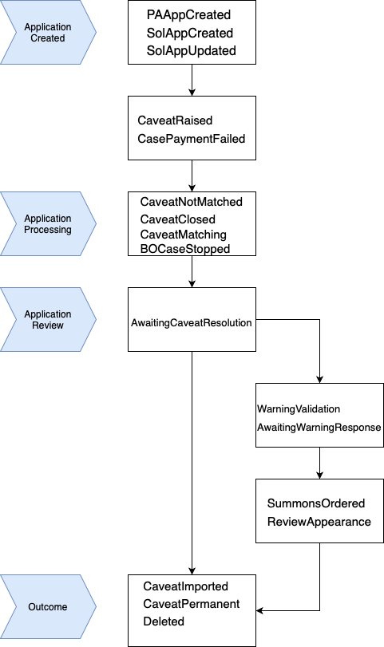
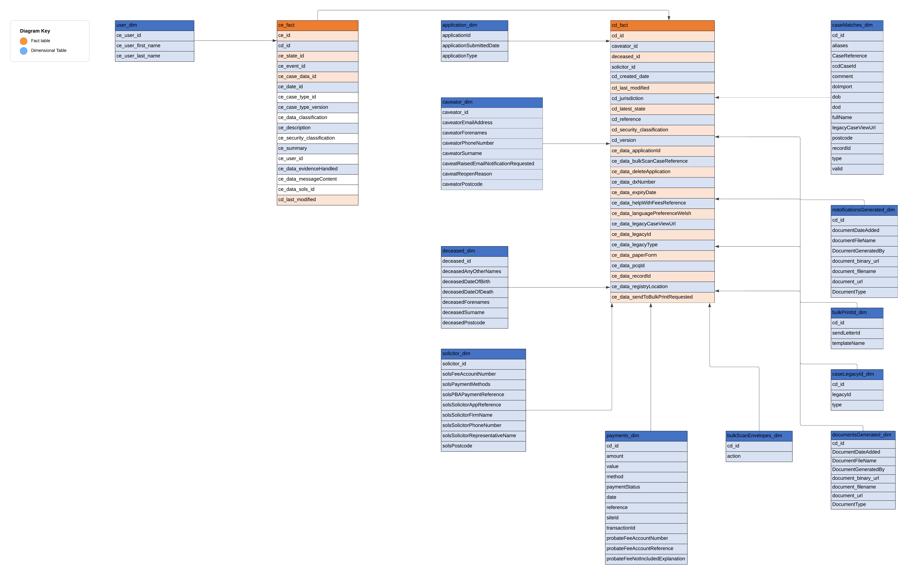

## Overview

A “probate caveat” is a legal notice to the court that a person has or may have an interest in a decedent’s estate, and they want to be notified before the court takes certain actions, like granting probate to a will. The primary purpose of filing a caveat is to prevent the probate of a will, at least temporarily, so that concerns or objections about the validity of the will or the appointment of a particular personal representative can be addressed.

Here’s a simplified breakdown:

	1.	Notification: A person (often a potential heir or beneficiary) files the probate caveat to alert the court of their interest in the estate or concerns about the will.
	2.	Probate Hold: Once a caveat is filed, the court typically won’t grant probate to the will without first addressing the concerns raised by the caveator (the person who filed the caveat).
	3.	Resolution: The issues brought up by the caveat might be resolved through legal hearings or other proceedings, where evidence is presented and the validity of the will or the suitability of the personal representative is determined.

## Understanding The Data

 We have performed [summary statistics](https://alpha-mojap-ccd.s3.eu-west-1.amazonaws.com/ccd-analysis/results/caveat/ccd_probate_analysis.html) of the probate data that is available on Athena to gain an overall understanding of the data, identify any empty variables, or those that contain only blocks of text that are not very useful for analysis. The data shows us that all the variables at event level have a "ce" prefix (i.e. ce_id, ce_event_id) whereas those relevant at case level have a "cd" prefix (i.e. cd_reference, cd_latest_state). So the first question we should be asking is whether we want our dimensional model to be at case or event level. There are around 300 duplicate rows that need to be removed. We can also see that there are 87 unique events within 17 possible states. Here is a flowchart of the overall caveat process. 

 

## Identifying Dimensions and Measures

Next, we needed to identify the key dimensions and measures within our data. Dimensions represent different ways to categorize our data, while measures are the numerical values we want to aggregate or analyze. We began by examining the JSON [code](https://github.com/moj-analytical-services/airflow-hmcts-sdp-load/blob/main/services/ccd/metadata/raw/probate_caveat.json) provided in the HMCTS probate repo. It contains columns and their corresponding attributes, providing valuable insights into our data structure. We will leverage this information to create our dimensional model. 
Some questions to ask when deciding:

1. Is the column a measure of business performance? If yes, it’s likely a fact. For example, “Total Sales”.
2. Is the column descriptive or categorical in nature? If yes, it’s likely a dimension attribute. For example, “Product Color”.
3. Is the column an identifier or transaction number without other related attributes? It might be a degenerate dimension in the fact table.
4. Does the column help to slice and dice the measures? If yes, it’s likely a dimension. For example, the “Country” dimension helps to analyze “Sales” by country.

However, always keep in mind the specific business requirements and context. Sometimes, design choices are influenced by factors like query performance, ease of use for end users, and the nature of the reporting.

## Designing Dimension Tables

Based on the identified dimensions, we will create our tables and these will capture the unique values of each dimension and any additional attributes. For example, we will have dimension tables for applicantOrganisationPolicy, bulkPrintId, caseMatches, scannedDocuments, bulkScanEnvelopes, documentsGenerated, documentsReceived, documentsScanned, caseLegacyId, events, and payments. In the json file we can also see several vaiables about the deceased or caveator which we can separate to create separate dimensional tables. 

## Designing Fact Tables

Moving on to designing the fact tables, which is the crucial part of this process we have agreed to create two tables: one at ce level and the other at cd level. 

The ce_fact table represents the fact data related to the case event information. It captures the primary key, ce_id, which uniquely identifies each ce event. This fact table will include foreign keys referencing the dimension tables associated with ce data. It allows us to analyze and measure various aspects of ce events, such as state and event details, along with their corresponding attributes.

The cd_fact table represents the fact data related to the cd (case data) information over time. It captures the primary key, cd_reference, which uniquely identifies each cd data entry. This fact table will include foreign keys referencing the dimension tables associated with cd data. It allows us to analyze and measure various aspects of cd data, such as creation dates, jurisdiction, references, and security classifications.

The main reason for having separate fact tables is to maintain the granularity and integrity of the data. In some scenarios, ce events and cd data may have different attributes, timeframes, or levels of detail. By separating them into distinct fact tables, we can analyze and report on them independently and accurately. This approach provides flexibility and avoids data redundancy or confusion when querying or aggregating the data. Having two fact tables also allows us to capture and analyze different aspects of the overall process. For example, the ce_fact table can focus on event-related metrics, such as event types, user information, and state transitions, while the cd_fact table can focus on case-specific details. So Separating the facts into two tables enables a clearer understanding and analysis of the distinct dimensions associated with each aspect of the data.

## Populating Dimension Tables

Once the dimension tables have been designed, we have populated them with the relevant data from the JSON file. This step ensures that we have complete and accurate dimension tables to reference in our dimensional model.

## Establishing Relationships

The next stage is to establish relationships with the use of foreign keys. These keys will connect the fact tables with the appropriate dimension tables, enabling us to combine and analyze data from different dimensions seamlessly. An example here is the user dimension table which is linked to the ce fact table by user_id where ce_id is the primary key and user_id is the foreign key.

For cases where there is no foreign key to link a dimensional table with the fact table, we have a couple of options to consider. We can build a bridge table, which acts as a mediator between the fact and dimensional tables, or introduce a surrogate key in the dimensional table. A surrogate key is a system-generated unique identifier that serves as a substitute for a missing or inadequate foreign key. By assigning a surrogate key to the dimensional table, we can establish a relationship with the fact table. 

In our example, we have a caveator dimensional table but no caveator_id in the overall probate data which means that we need to create a surrogate key to link this table with the relevant fact table. DBT has an in-built [macro](https://github.com/dbt-labs/dbt-utils#generate_surrogate_key-source) where you can specify which columns to use to create the key.

The two fact tables are linked via cd_id which is a surrogate key generated using the cd_reference and cd_last_modified.

It’s important to note that the absence of a foreign key can impact the integrity and completeness of the dimensional model. It’s recommended to thoroughly assess the implications and consult with subject matter experts and stakeholders to determine the best approach for handling such scenarios.

## Validating and Refining the Model

It's important to note that this whole process is iterative. Things will keep changing and before finalizing the dimensional model, we need to validate and refine it. We will review the model and make any necessary adjustments based on your feedback and specific business requirements but it is also important to acknowledge the limitation of our own data.

## Creating the Star Schema

What you are seeing is a possible star schema. In the star schema, the fact tables (ce_fact and cd_fact) serve as the central points, connected to various dimension tables. Each dimension table captures specific attributes related to the ce and cd data, enabling efficient analysis and reporting.
After various discussion We have omitted the cavatorAddress and deceasedAddress dimension tables as we agreed that usually only the postcode is required for any geospatial or statistical analysis and we kept them in caveator and deceased person dimension tables. 

By looking at cd fact table you are probably questioning why there are some ce variables there and the reason is that these variables are consistent throughout the case and they are not affected by a change in event and as our goal is to keep tables as simple and consistent as possible we decided to move them under the cd fact table. You may also decide that some of these variables are not even needed for the analysis so we can omit them completely.

 

## Closure
That concludes our explanation of the end-to-end process for building the probate dimensional model based on the provided JSON code. By following this process and leveraging the star schema, we can easily analyze and gain valuable insights from our data. 
