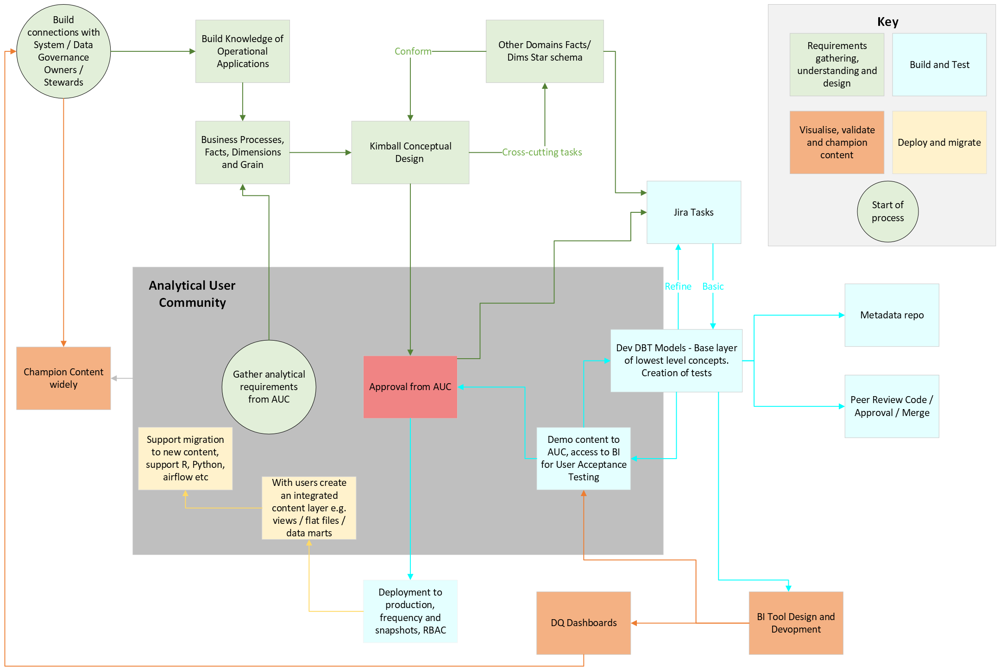

# Data Modelling Overview

⚠️ This service is in beta ⚠️

This page is intended to give users a brief introduction to Dimensional Modelling concepts, the process the Data Modelling team take toc reate Dimensional Models, and why we are using `dbt` as the backend for `create-a-derived-table`. Please post suggestions to improve this document in our slack channel [#ask-data-modelling](https://asdslack.slack.com/archives/C03J21VFHQ9), or edit and raise a PR.

## Dimensional Modelling: Key Conepts

Data modelling is the process of creating a structured representation of data. There are several approaches to creating a data model but the data modelling team tends to use and endorse the dimensional modelling approach introduced by Ralph Kimball. If you have hear the term data modelling used by members of the team then it is likely they are referring to dimensional modelling. 

This section contains several important concepts related to dimensional modelling and the explanations are heavily influenced by explanations given in the following book 'The Data Warehouse Toolkit, 3rd Edition' by Ralph Kimball and Margy Ross. This book as well as 'Kimball Dimensional Modeling Techniques' [PDF LINK TO ADD] are great places to start if you want to dive deeper into dimensional modelling.

### What is Dimensional Modelling

Dimensional Modelling involves designing the data structure in a way that optimizes querying and analysis. This is done through organising data into easily understandable "dimensions" (descriptive categories, such as time, geography, or product) and "facts" (measurable metrics, such as sales or revenue). The core guiding principle behind dimensional modelling is simplicity. Simplicity is critical because it ensures that users can easily understand the data, as well as allows software to navigate and deliver results quickly and efficiently.

### What are Fact Tables
The fact table in a dimensional model stores the measurements or outcomes which results from an event. You should strive to store the low-level measurement data resulting from a business process in a single dimensional model.

Each row in a fact table corresponds to a measurement event. The data on each row is at a specific level of detail, referred to as the grain, such as one row per disposal. One of the core tenets of dimensional modelling is that all the measurement rows in a fact table must be at the same grain. Having the discipline to create fact tables with a single level of detail ensures that measurements aren’t inappropriately double-counted.

### What are Dimension Tables
Dimension tables are integral companions to a fact table. The dimension tables contain the descriptive context associated with a fact table event. They describe the “who, what, where, when, how, and why” associated with the event.

### What is a Star Schema 
A star schema is a dimensional model which contains a sigle fact table containg the measurements/outcomes of a business process  which is connected to several dimension tables that provide the descriptive context for that measurement/outcome. For example for a disposal dimensional model we would have a single fact table containing the disposals that occured and then several dimension tables such as defendant, offence, court. A visual example can be seen here [LINK to Khristiania's diagram]

### What is meant by the "Grain" of the data.
The grain is the level of detail a row of data in a fact table is. Often work from the principle that it is best to use the atomic grain which is the lowest level grain as it is easier to aggregate up compared to disaggregating. A fact table must have a consistent grain though different fact tables can have different grains e.g. we can have a disposal fact table and a cases fact table. 

## Process of creating a Dimensional Model.

1. In conjunction with the analytical user community, gather analytical requirements – use interviews / workshops to document findings including lists of extracts, reports and fields; data definitions; metric / KPI definitions; and existing data transformations being applied to raw / source data, as well as quality expectations.  Capture how users and analysts describe the entities, business processes, dimensions, facts and granularity associated with the system(s) in question.
 
1. Understand who the system owners are of the source database you will be using and devlop relationships with them

1. Work with these data suppliers / operational users to understand system structure, operational usage / training materials and business processes.  Document these and any limitations or caveats (of both used and unused fields; via data discovery tool and/or DBT docs).  May require the use of data modelling software and/or creation of DDL scripts to reverse-engineer / represent relationships between operational tables.  Then, in conjunction with capturing how system users and managers describe the business processes and entities (in terms of dimensions, facts and granularity) that the system(s) underpin, and the knowledge and requirements gathered, identify relevant core concepts as the basis of a simple, effective dimensional data structure that is recognisable and intuitive for stakeholders.
 
1. Develop a conceptual / star schema based view of the domain which: de-normalises the application database / source data, based around business processes, facts (additive; semi-additive; non-additive), and hierarchical dimensions at atomic / lowest level of granularity; and documents / presents this content to all stakeholders via the bus matrix and basic diagrams.  As well as de-normalising operational database content into facts and dimensions, transformation / designs may require a) extraction of structured data from document-oriented storage such as JSON or XLM; or b) modelling / extraction / separation of entities from flat files into a more normalised dimensional structure.
 
1. Test / agree conceptual design with all relevant stakeholders

1. Cross reference with broader content via the bus matrix and identify additional steps needed to conform content across domains – brings enterprise-level perspective and facilitates integration / joins between concepts from disparate data sources to underpin exploratory analysis and insight discovery.
 
1. Break down the conceptual design into high-level tasks for Jira / augment existing dimension development tasks where necessary.  Determine data source(s), structure and slowly changing dimension approach for each dimension. 
 
1. For each atomic / lowest-level concept, develop logical content / metadata and translate this into physical content using SQL / DBT code.  Content to be developed through a series of staging, intermediate, fact and dimension tables, building sequentially upon earlier models using DBT functionality and materialised in DEV Athena databases.  

1. Provide regular demonstrations to the user and governance communities to explore issues / conflicts and to refine content.
 
1. Throughout development: seek peer review of SQL / DBT code to ensure appropriate and meaningful level of decomposition; and provide content to domain representatives (via BI / query tool if possible - requires design, development, deployment and maintenance; or as simple extracts) for review, validation, and detailed feedback.
 
1. As content firms up, develop tests / quality assurance checks to apply during each transformation / load.  Relevant content to be captured and presented via Data Quality dashboards (requires design, development, deployment and maintenance of consistent, basic BI applications to support ongoing access / review / action / improvement) and via searchable metadata tools.  Content to include for example record counts across key dimensions such as time, geography and relevant categories to identify levels of missingness and value distributions.  Adopt machine learning techniques to explore and identify areas of potential interest in the data across relevant variable interactions; flag areas of interest to users / owners as part of data transformation and load activities, and to support data and service quality improvement efforts.
 
1. Establish relationships with, and push specific data quality issues to, system owners / data stewards to address in source systems; also collate findings to identify regular issues where design changes to underlying systems may be required to prevent issues from occurring.
 
1. Develop and implement through coding: update frequency; snapshot requirements; and security / role-based access design as part of preparing to deploy content to PROD.
 
1. Deploy atomic / lowest level concept content to PROD with agreed update frequency; snapshot creation schedule and data quality content / fix processes.
 
1. Work with the relevant analytical user community to migrate their outputs and processes to use (and further validate) the newly created content.  Depending on skills / experience / available resources, this step may include the development of extracts / data marts which combine atomic concepts to replicate existing content.  Requires exploration and understanding of existing processes, including potentially R, Python, SAS, Airflow, Excel, etc. skills to enable new content to be spliced neatly into production / dissemination pipelines.  In any event, describe and support for key users:
a. 	core development processes and how users can augment base content (with governed review / approval from data modelling team); and
b. 	how users can develop extracts / data marts / OLAP cubes themselves, that bring together core concepts / create aggregated metrics and key performance indicators, to address specific analytical use cases (including documentation to support re-use)
 
1. Present / champion core and integrated content regularly at forums across Data & Analysis to encourage standardisation in data source and metric usage – support user community to connect with / make best use of content via searchable metadata repositories (data discovery tool / DBT docs?) and provide weekly drop-in sessions for creators to connect users with content and/or to provide advice and support on new content creation, where required.
 
1. Use these forums, and other regular communicates routes, to capture new requirements for further prioritisation and development

## The benefits of dbt.