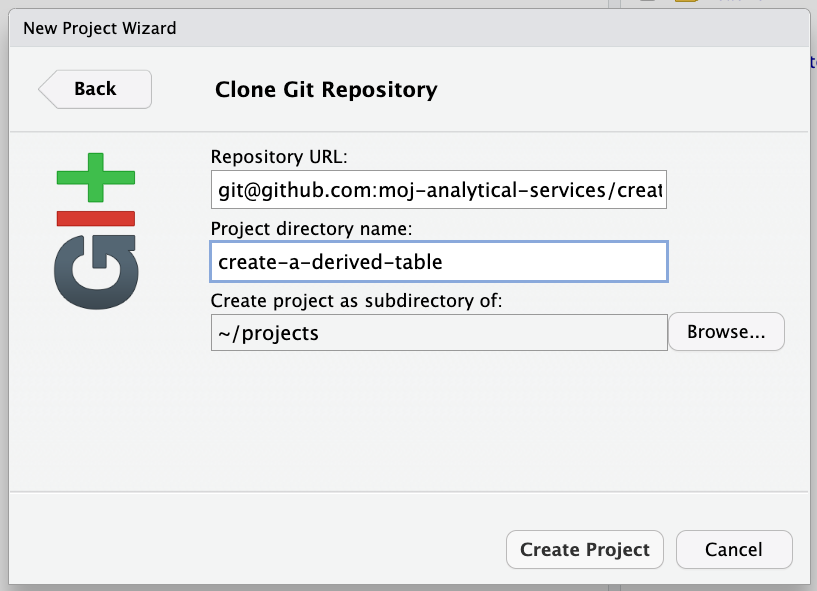

# Interactive Development Environment (IDE) Set Up

You'll need an interactive development environment (IDE) to interact with the repository and write your SQL and YAML code, and a Python virtual environment for dbt to run in. The following sections will show you how to set that up in RStudio or Visual Studio Code.

It's worth noting at this point that you'll just be using RStudio or Visual Studio Code as an IDE to interact with the repository (and git), write SQL and YAML code, and to run dbt commands from the terminal in a Python virtual environment. There is no R programming going on. We're currently not planning to get Create a Derived Table up and running with JupyterLab, as the RStudio and Visual Studio Code IDEs are sufficient.


## Clone the repository using the RStudio GUI

Select `file` > `New Project...` > `Version Control` > `Git` and paste the following into the text fields and then select which directory you would like to clone the repository to.

- Repository URL: `git@github.com:moj-analytical-services/create-a-derived-table.git`
- Project directory name: `create-a-derived-table`




## Clone the repository using the terminal

`cd` to the directory where you'd like to clone the repository to and then run the following command:

```
git clone git@github.com:moj-analytical-services/create-a-derived-table.git
```

## Setting up a Python virtual environment

Python versions 3.7, 3.8, 3.9, 3.10 and 3.11 are compatible with dbt-core v1.5.0.

In the terminal, `cd` into the root of the repository (`create-a-derived-table`). You can check you're in the correct directory by runnnig `pwd`. Once you've done that run:

```
python3 -m venv venv
```

```
source venv/bin/activate
```

```
pip install --upgrade pip
```

```
pip install -r requirements.txt
```

To install the lint libraries, run:

```
pip install -r requirements-lint.txt
```

Set the following environment variable in your Bash profile:

```
echo "export DBT_PROFILES_DIR=../.dbt/" >> ~/.bashrc
```

Then source your Bash profile by running:

```
source ~/.bashrc
```

You'll need to be in the dbt project to run dbt commands. This is the `mojap_derived_tables` directory:

```
cd mojap_derived_tables
```

Then to check an active connection, run:

```
dbt debug
```

If that's successful, to install dbt packages, run:

```
dbt deps
```

Congratulations, you're now ready to get dbt-ing!

## Show indent guides in RStudio

In RStudio you can display vertical guidelines to help you keep track of indetations in your code; this is very helpful in YAML files. In the RStudio IDE go to 

**Tools → Global Options → Code → Display** 

and check the box for **Show indent guides**. 

You will also want to set your tab width to 2 spaces, to do this go to 

**Tools → Global Options → Code → Editing**

and check the box for **Insert spaces for Tab** and set **Tab width** to **2**.
 
<br />