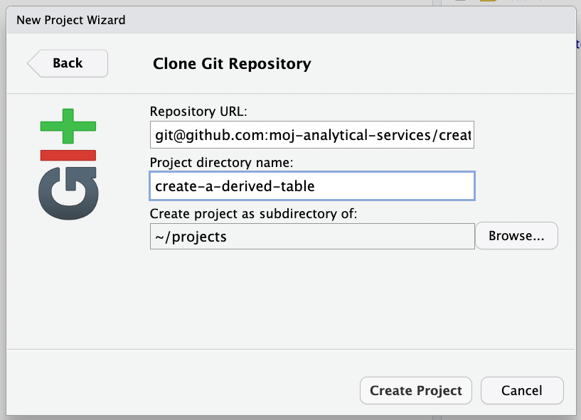

# Create a Derived Table Instructions

⚠️ This service is in beta ⚠️
 
 Read on to find out more or get in touch at the [#ask-data-modelling](https://asdslack.slack.com/archives/C03J21VFHQ9) channel.

# Table of Contents

- [What is Create a Derived Table?](#what-is-create-a-derived-table)
- [The dbt project](#the-dbt-project)
  - [Domains](#domains)
  - [Databases](#databases)
  - [Standard directory structure and naming conventions](#standard-directory-structure-and-naming-conventions)
  - [Data modelling](#data-modelling)
- [Getting started](#getting-started)
  - [Standard database access](#standard-database-access)
  - [Your Data Engineering Database Access project access file](#your-data-engineering-database-access-project-access-file)
  - [Setting up your working environment](#setting-up-your-working-environment)
    - [JupyterLab](#jupyterlab)
    - [RStudio](#r-studio)
    - [Cloning the repository](#cloning-the-repository)
      - [Using the RStudio user interface](#using-the-r-studio-user-interface)
      - [Using the terminal](#using-the-terminal)
    - [Setting up a Python virtual environment](#setting-up-a-python-virtual-environment)
  - [Collaborating with Git](#collaborating-with-git)
    - [Creating branches](#creating-branches)
- [Creating models](#creating-models)
  - [What is a model?](#what-is-a-model)
  - [Model properties](#model-properties)
    - [Where can I define configs?](#where-can-i-define-configs)
    - [Config inheritance](#config-inheritance)
  - [Writing models](#writing-models)
    - [Sources](#sources)
    - [The ref function](#the-ref-function)
  - [Materialisations](#materialisations)
- [What are seeds?](#what-are-seeds)
- [Tests](#tests)
  - [Custom generic tests](#custom-generic-tests)
  - [Singular tests](#singular-tests)
  - [Configuring tests](#configuring-tests)
- [What else?](#what-else)
  - [Macros](#macros)
  - [Seeds](#seeds)
  - [dbt packages](#dbt-packages)
  - [dbt artefacts](#dbt-artefacts)
  - [Using the + prefix](#using-the-plus-prefix)
  - [Linting](#linting)
    - [Linting YAML files](#linting-yaml-files)
    - [Linting SQL files](#linting-sql-files)
    - [Fomatting SQL files](#fomatting-sql-files)
- [Scheduling](#scheduling)
- [Deploying your tables](#deploying-your-tables)
  - [Dev](#dev)
    - [Helpful commands](#helpful-commands)
    - [How to use the incremental materialisation with the append strategy](#how-to-use-the-incremental-materialisation-with-the-append-strategy)
  - [Prod](#prod)
- [Resources](#resources)
- [License](#license)

:warning: This service is in beta :warning: Read on to find out more or get in touch at the [#ask-data-modelling](https://asdslack.slack.com/archives/C03J21VFHQ9) channel.

# What is Create a Derived Table?

Create a Derived Table is a service that brings dbt, Git, and data access controls together to allow you to deploy tables derived from data available on the Analytical Platform; straight to Athena, in a reproducible way, and with scheduled table updates. All you’ll need to do is submit the SQL to derive your tables along with a few configuration files in a GitHub PR. dbt is at the core of Create a Derived Table and it's packed full of features for transforming data using SQL so you'll need to get familiar with certain bits of dbt syntax. To learn more about dbt, take a look at [their documentation](https://docs.getdbt.com/docs/introduction). Some of the basics about working with dbt are covered below, but you can also sign up and work through [dbt's own training courses](https://courses.getdbt.com/collections) for free. The training uses their own user interface instead of Create a Derived Table but it's still relevant here.

We’re still in beta so we'd love to get some of you using Create a Derived Table to get your feedback to help guide best practice data modelling in the Ministry of Justice and make sure we can continue to improve the user experience.

# The dbt project

This service should be used for creating tables with well defined use cases, like to serve a performance metric, publication, or MI report. This is because the _dbt project_ (`mojap_derived_tables`) is a shared space and so knowing where to put your work in the broader structure of the project is key. That's not to say you can't explore and experiment with dbt within the dbt project, there's a development envionment where you can try things out without having to worry about making a mess of things. More on that later.

## Domains

The primary consideration relating to project structure is understanding which domain the table you want to create belongs to. In Create a Derived Table a domain should correspond to some service area or core business concept and is used to logically group databases. Domains are not mutually exclusive so the same concepts can exist in different domains. A domain may be _'people'_ relating HR and corporate, or _'risk'_ relating to a justice system service user's safety, but it could be more or less granular if appropriate.

## Databases

The secondary consideration is whether the tables you are creating belong in an existing database, if they do, then this step is easy. If you need to create a new database then you'll need to decide which domain to put it in. It's also possible to define a database across multiple domains. For example, a number of tables within your database might sit within 'domain a' while the rest sit in 'domain b'. This approach has the benefit of keeping all tables logically grouped within one database but will result in access to those tables being limited by the domain.

## Standard directory structure and naming conventions

The following is an example of how a team might build a data model whilst adhearing to the standard dbt project directory structure required to work with Create a Derived Table. The Prison Safety and Security team have created a database called `prison_safety_and_security` in the `security` domain.

- From the `mojap_derived_tables` dbt project, the hierarchy of directories must follow `models` -> `domain` -> `database`. The directory structure after this is arbitrary and can be chosen to suit your needs. However, we do recommend that you arrange your models into data marts and suffix your models with descriptions (this will be discussed in more detail).
- Directory and file names should only use snake case, as in, `no-hyphens-like-this`, `just_underscores_like_this`.
- Models (`.sql` files) must be named by the database and table they relate to separated by double underscores, i.e., `<database_name>__<table_name>.sql`. This is because all models in the `models` directory must have a unique name.
- Suffixes should be added that describe each model's purpose.
  - Fact and dimension models should be suffixed with `_fct` and `_dim` respectively.
  - Intermediate models should be suffixed with the main transformation being applied in past tense, e.g., `_grouped` or `_left_joined`.
- You may want to arrange staging models into a specific staging database, or within a single database for all your tables.
  - Staging models should be suffixed with `_stg` unless built into a specific staging database.
- Fact, dimension, and staging models must have their own property file that has the same filename as the model they define properties for.
- Intermediate models should have a single configuration file named `properties.yaml`.
- Seed property files must have the same filename as the seed they define properties for.

If you have ideas about how you would like to structure your data model, please get in touch as we'd love to hear from you to help guide best practice principles.

```
├── mojap_derived_tables
  ├── dbt_project.yml
  └── models
      ├── sources
      │   ├── nomis.yaml
      │   ├── oasys_prod.yaml
      │   ├── delius_prod.yaml
      │   ├── xhibit_v1.yaml
      │   ...
      ├── security  # domain
      │   ├── prison_safety_and_security  # database
      │   │   ├── marts
      │   │   │   ├── intermediate
      │   │   │   │   ├── prison_safety_and_security__inc_ids_grouped.sql  # intermediate table
      │   │   │   │   ├── prison_safety_and_security__questions_filtered.sql  # intermediate table
      │   │   │   │   ├── prison_safety_and_security__question_set_joined.sql  # intermediate table
      │   │   │   │   └── properties.yaml  # intermediate tables property file
      │   │   │   └── question_answers  # arbitrary grouping
      │   │   │       ├── prison_safety_and_security__dates_dim.sql  # dimension table
      │   │   │       ├── prison_safety_and_security__dates_dim.yaml  # table property file
      │   │   │       ├── prison_safety_and_security__incidents_fct.sql  # fact table
      │   │   │       ├── prison_safety_and_security__incidents_fct.yaml  # table property file
      │   │   │       ├── prison_safety_and_security__question_answer_fct.sql  # fact table
      │   │   │       └── prison_safety_and_security__question_answer_fct.yaml  # table property file
      │   │   └── staging
      │   │       ├── prison_safety_and_security__nomis_mod_stg.md  # markdown to be rendered in documentation
      │   │       ├── prison_safety_and_security__nomis_mod_stg.sql  # staging table
      │   │       └── prison_safety_and_security__nomis_mod_stg.yaml  # table property file
```

## Data modelling

Data modelling is hard, so if the considerations about domains, databases, or data model structures aren't clear, reach out to the [data modelling team](https://asdslack.slack.com/archives/C03J21VFHQ9) and we'll do our best to help you out.

# Getting started

## Standard database access

The first thing you'll need to work with Create a Derived Table is an [Analytical Platform account](https://user-guidance.services.alpha.mojanalytics.xyz/get-started.html#2-analytical-platform-account) with standard database access. If you don't have that already, follow the [guidance on how to make changes to the standard database access project file](https://github.com/moj-analytical-services/data-engineering-database-access#standard-database-access) in the Data Engineering Database Access repo.

## Your Data Engineering Database Access project access file

As well as standard datbase access, you'll need a project access file that's specific to your (or your team's) work. This will give you access to the source databases used to derive tables as well as the derived tables themselves. Access to derived tables is granted at the domain level, this means you will need to know which domain you will be creating derived tables in before you start working. Your project file should include the source databases and domain(s) that you'll use to derive your tables from, and the domain(s) that your tables will go in. A list of already available domains can be found in the [database access resources for Create a Derived Table](https://github.com/moj-analytical-services/data-engineering-database-access/tree/main/database_access/create_a_derived_table). If you don't know already, you can learn how to set up a project access file by following the guidance on [access to curated databases](https://github.com/moj-analytical-services/data-engineering-database-access#access-to-curated-databases) in the Data Engineering Database Access repo.

A typical project access file might look like:

```
project_id: Analytical Team 1 Derived Tables

review_date: 2022-10-20
approver_position: >=G7 of Analytical Team 1 Derived Tables
approver_email: approver.name@justice.gov.uk
alternative_approver_emails:
  - alternative.approver-name@justice.gov.uk

resources:
  - create_a_derived_table/domain_a
  - create_a_derived_table/domain_b
  - source_database_a/full
  - source_database_b/full

users:
  - alpha_user_name_a
  - alpha_user_name_b
  - alpha_user_name_c

business_case: >
  To create derived tables for Analytical Team 1.
```

## Setting up your working environment

You'll need an interactive development environment (IDE) to interact with the repository and write your SQL and YAML code, and a Python virtual environment for dbt to run in. The following sections will show you how to set that up.

### JupyterLab

We're currently not planning to get Create a Derived Table up and running with JupyterLab, as the RStudio IDE is sufficient.

### RStudio

It's worth noting at this point that you'll just be using RStudio as an IDE to interact with the repository (and git), write SQL and YAML code, and to run dbt commands from the terminal in a Python virtual environment. There's nothing related to the R programming language going on.

### Cloning the repository

#### Using the RStudio user interface

Select `file` > `New Project...` > `Version Control` > `Git` and paste the following into the text fields and then select which directory you would like to clone the repository to.

- Repository URL: `git@github.com:moj-analytical-services/create-a-derived-table.git`
- Project directory name: `create-a-derived-table`




#### Using the terminal

`cd` to the directory which you'd like to clone the repository to and then run the following command:

```
git clone git@github.com:moj-analytical-services/create-a-derived-table.git
```

### Setting up a Python virtual environment

In the terminal, `cd` into the root of the repository (`create-a-derived-table`). You can check you're in the correct directory by runnnig `pwd`. Once you've done that run:

```
python3 -m venv venv
```

```
source venv/bin/activate
```

```
pip install --upgrade pip
```

```
pip install -r requirements.txt
```

Set the following environment variable in your Bash profile:

```
echo "export DBT_PROFILES_DIR=../.dbt/" >> ~/.bash_profile
```

Then source your Bash profile by running:

```
source ~/.bash_profile
```

You'll need to be in the dbt project to run dbt commands. This is the `mojap_derived_tables` directory:

```
cd mojap_derived_tables
```

Then to check an active connection, run:

```
dbt debug
```

If that's successful, to install dbt packages, run:

```
dbt deps
```

Congratulations, you're now ready to get dbt-ing!

## Collaborating with Git

If you're working on a data model as part of a team you can take inspiration from the [Gitflow Workflow](https://www.atlassian.com/git/tutorials/comparing-workflows/gitflow-workflow) to effectively collaborate and develop your data model. The following is a recommendation, so feel free to use another approach if there's one that suits your team better.

- Start with a main branch for your team. Because there is already a `main` branch in the repository, we suggest you create a branch from the `main` branch and name it something like `project-name-main` or `team-name-main`.
- Next Analyst 1 is working on `table_a`, while Analyst 2 is working on `table_b`.
  - Analyst 1 should create a branch off `project-name-main` called `a1/model-a-development`, prefixing the branch name with their initials and a slash `a1/`.
  - Analyst 2 should create a branch off `project-name-main` called `a2/model-b-development`, prefixing the branch name with their initials and a slash `a2/`.
- When they have completed the development of their respective models, each analyst should raise a pull request for their respective branches and set the base branch to `project-name-main`.
- The analysts, or someone else in the team, can then review the pull request and quality assure the work.
- When a pull request has been merged into `project-name-main`, keep other feature branches like `a2/model-b-development` up to date by merging `project-name-main` into it. You can do this using the terminal or in the pull request itself where you will see a button at the bottom of the pull request page that says `Update branch`. If you do use the pull request to update the branch, you'll need to run `git pull` locally. When the data model is complete and all changrs have been merged into `project-name-main`, you can request review from the data modelling team who will check it over before it gets merged into `main`.

### Creating branches

First make sure you're on the `main` branch by running:

```
git status
```

If you're not, run:

```
git checkout main
```

```
git pull
```

Next create your `project-name-main` branch (don't forget to update the project name in the command) by running:

```
git checkout -b <project-name-main>
```

From the `project-name-main` branch, create your development branch by running:

```
git checkout -b <a1/model-a-development>
```

replacing `a1` with your initals.

# Creating models

## What is a model?

A model is a `select` statement. Models are defined in `.sql` files and each `.sql` file contains one model/`select` statement. The term 'model' is almost synonymous with 'table' and for the most part can be used interchangeably and thought of the same thing. The term 'model' is used because a model can be materialised in different ways; it can be ephemeral, a view, or indeed a table. More on materialisations later. From here on the term 'model' will be used instead of 'table'.

## Model properties

Resources in your project — models, seeds, tests, and the rest — can have a number of declared properties. Resources can also define configurations, which are a special kind of property that bring extra abilities. What's the distinction?

- Properties are declared for resources one-by-one in `.yaml` files. Configs can be defined there, nested under a `config` property. They can also be set one-by-one via a `config()` macro directly in model (`.sql`) files, and for many resources at once in `dbt_project.yml`.
- Because configs can be set in multiple places, they are also applied hierarchically. An individual resource might inherit or override configs set elsewhere.
- A rule of thumb: properties declare things about your project resources; configs go the extra step of telling dbt how to build those resources in Athena. This is generally true, but not always, so it's always good to check!

For example, you can use resource properties to:

- Describe models, snapshots, seed files, and their columns
- Assert "truths" about a model, in the form of tests, e.g. "this id column is unique"
- Define pointers to existing tables that contain raw data, in the form of sources, and assert the expected "freshness" of this raw data
- Define official downstream uses of your data models, in the form of exposures

Whereas you can use configurations to:

- Change how a model will be materialised (table, view, incremental, etc)
- Overwrite where model or seed data will be written to
- Declare whether a resource should persist its descriptions as comments in the database
- Apply tags and "meta" properties

### Where can I define configs?

Configure a whole directory of models, seeds, tests, etc. from the `dbt_project.yml` file, under the corresponding resource key (`models:`, `seeds:`, `tests:`, etc). In the example below the `materialized: table` configuration has been applied to the entire `mojap_derived_tables` project. The `sentences/` and `question_answers/` directories have schedule `tags` configured for all models in those respective directories. ⚠️ Only add configurations to your own work! ⚠️

```
models:
  mojap_derived_tables:
    +materialized: table

    prison:
      prison_safety_and_security:
        marts:
          sentences:
            +tags: monthly

          question_answers:
            +tags: weekly
```

Configure an individual model, seed, or test using a `config` property in a `.yaml` property file. This is the preferred method for applying configurations because it groups the configurations with defined properties for a given model, etc. and provides good visibility of what's being applied. The below example applies the incremental materialisation and partitioned by configuration to the `question_answer_fct` model.

```
version: 2

models:
  - name: prison_safety_and_security__question_answer_fct
    description: The question and answer fact table.
    config:
      materialized: incremental
      incremental_strategy: append
      partitioned_by: ['snapshot_date']
      +column_types:
        column_1: varchar(5)
        column_2: int    
```

If for some reason it is not possible or reasonable to apply a configuration in a property file, you can use a `config()` Jinja macro within a model or test SQL file. The following example shows how the same configuration above can be applied in a model or test file.

```
{{
  config(
      materialized='incremental'
      incremental_strategy='append'
      partitioned_by=['snapshot_date']
  )
}}
```

### Config inheritance

Configurations are prioritised in order of specificity, which is generally the inverse of the order above: an in-file `config()` block takes precedence over properties defied in a `.yaml` property file, which takes precedence over a configuration defined in the `dbt_project.yml` file. (Note that generic tests work a little differently when it comes to specificity. See dbt's documentation on [test configs](https://docs.getdbt.com/reference/test-configs).)

## Writing models

### Sources

Sources are descriptions of the databases and tables already in Analytical Platform. With those tables defined as sources in dbt, it is then possible to select from source tables in your models using the [`source()`](https://docs.getdbt.com/reference/dbt-jinja-functions/source) function which helps define the lineage of your data. To see which sources have been defined, look in the [`./mojap_derived_tables/models/sources/`](./mojap_derived_tables/models/sources/) directory. If a database or table hasn't been defined as a source, let the data modelling know at [#ask-data-modelling](https://asdslack.slack.com/archives/C03J21VFHQ9) and we'll look into adding it if it's appropriate to do so. Below is an example of using the `source()` function to select from the `contact` table in the `delius_prod` database:

`model_a.sql`

```
select * from {{ source("delius_prod", "contact") }} limit 10
```

### The ref function

The most important function in dbt is [`ref()`](https://docs.getdbt.com/reference/dbt-jinja-functions/ref); it's impossible to build even moderately complex models without it. `ref()` is how you reference one model within another as typically models are built to be 'stacked' on top of one another. These references between models are then used to automatically build the dependency graph. Here is how this looks in practice:

`model_b.sql`

```
select contact_id from {{ ref("model_a") }} 
where mojap_current_record=true
```

## Materialisations

Materialisations are strategies for persisting dbt models in a warehouse. There are four types of materializations built into dbt. They are:

- [table](https://docs.getdbt.com/docs/build/materializations#table)
- [view](https://docs.getdbt.com/docs/build/materializations#view) :warning: not currently supported :warning:
- [incremental](https://docs.getdbt.com/docs/build/materializations#incremental)
- [ephemeral](https://docs.getdbt.com/docs/build/materializations#ephemeral)

# What are seeds?

Seeds are lookup tables easily created from a `.csv` file. Put the `.csv` in the [`./mojap_derived_tables/seeds/`](./mojap_derived_tables/seeds/) directory and follow the same directory structure requirements and naming conventions as for models. As with marts models, your seeds should have property files that have the same filename as the seed. Seeds can be accessed by anyone with standard database access and so must not contain sensitive data. Generally, seeds shouldn't contain more than 1000 rows, they don't contain complex data types, and they don't change very often. You can deploy a seed with more than 1000 rows, but it's not reccomended and it will take quite a long time to build.

:warning: Seeds must not contain sensitive data. :warning:

# Tests

Tests are assertions you make about your models and other resources (e.g. sources, seeds and snapshots). You can do things like test whether a column contains nulls or only unique values, compare row counts between tables, or check all of the records in a child table have a corresponding record in a parent table. dbt ships with some [tests](https://docs.getdbt.com/reference/resource-properties/tests) you can use but there many more out there in packages like [dbt_utils](https://hub.getdbt.com/dbt-labs/dbt_utils/latest/), so do checkout dbt's package hub for what's available.

For more information on tests, see [dbt's tests documentation](https://docs.getdbt.com/docs/building-a-dbt-project/tests).

## Custom generic tests

A test is really just a SQL query that returns rows that meet a certain criteria. If the number of returned rows is not zero, then the test fails. When you know that, you'll soon realise that it's not too difficult to write your own tests. Tests you write yourself are called custom generic tests and are writen in special macros; read the [dbt guidance on how to write custom generic tests](https://docs.getdbt.com/guides/legacy/writing-custom-generic-tests) to find out more. There are some requirements specific to Create a Derived Table that you must follow when writing custom generic tests. They must live subdirectory named after the team, project, or database they relate to in the [`./mojap_derived_tables/tests/generic/`](./mojap_derived_tables/tests/generic/) directory and should follow a naming convention where the subdirectory and test name are separated by double underscores, for example `team_name__test_name`. This is so that ownership of the test is clear and so that the filename is unique.

```
├── mojap_derived_tables
  ├── dbt_project.yml
  └── tests
      └── generic
          ├── prison_safety_and_security  # team name
              ├── prison_safety_and_security__test_name.sql
              ...
          ├── other_project_name  # project name
              ├── other_project_name__test_name.sql
              ...
          ├── other_database_name  # database name
              ├── other_database_name__test_name.sql
              ...
          ...
```

## Singular tests

Singular tests should not be used and they will not be run in the production environment.

## Configuring tests

Defining tests for your resources is done within the property file for that resource under the `tests` property. See the example below.

```
version: 2

models:
  - name: <model_a>
    tests:
      - dbt_utils.equal_rowcount:
          compare_model: <model_b>
    columns:
      - name: <column_a>
        tests:
          - not_null
          - dbt_utils.not_constant
```

# What else?

## Macros

Macros are just Jinja functions. You can write your own macros which should live at [`./mojap_derived_tables/macros/`](./mojap_derived_tables/macros/), see [dbt's docs on Jinja macros](https://docs.getdbt.com/docs/building-a-dbt-project/jinja-macros).

## dbt packages

There is an ecosystem of packages containing helpful macros and tests you can use, see [dbt package hub](https://hub.getdbt.com/dbt-labs/dbt_utils/latest/). If you need a package adding to the dbt project, update the [`packages.yml`](./mojap_derived_tables/packages.yml) file then rerun `dbt deps`.

## dbt artefacts

When dbt runs it generates artefacts. The most useful of these to you will be the logs in the `./mojap_derived_tables/logs/` directory and compiled SQL in the `./mojap_derived_tables/target/` directory. Compiled SQL can be useful when debugging errors as error messages will often refer to the line number in the compiled SQL and not that in your model file.

## <a id="using-the-plus-prefix"></a>Using the + prefix 

The `+` prefix is a dbt syntax feature which helps disambiguate between resource paths and configurations in the `dbt_project.yml` file. If you see it used in the `dbt_project.yml` file and wonder what it is, read [dbt's guidance on using the `+` prefix](https://docs.getdbt.com/reference/resource-configs/plus-prefix). It is also used to configure properties in a nested dictionary which take a dictionary of values in a model, seed or test config .yaml. For example, use `+column_types` rather than `column_types` since what follows are further key and value pairs defining the column names and the required data type. It doesn't hurt to use `+` prefix so it is recommended to always do so.

```
version: 2

models:
  - name: prison_safety_and_security__question_answer_fct
    description: The question and answer fact table.
    config:
      materialized: incremental
      incremental_strategy: append
      partitioned_by: ['snapshot_date']
      +column_types:
        column_1: varchar(5)
        column_2: int
        column_3: string
```

## Linting

Linting is the automated checking of your code for programmatic and stylistic errors performed by running a 'linter'. The linter will analyse your code and output error messages to the terminal. Linters should be run from the root of the repository, i.e., the `create-a-derived-table` directory.

### Linting YAML files

To lint a single YAML file, run:

```
yamllint .../path/to/yaml/file.yaml
```

Or a whole directory of YAML files by running:

```
yamllint .../path/to/yaml/directory/
```

### Linting SQL files

To lint a single SQL file, run:

```
sqlfluff lint .../path/to/sql/file.sql
```

Or a whole directory of SQL files by running:

```
sqlfluff lint .../path/to/sql/directory/
```

### Fomatting SQL files

SQLFluff is a formatter as well as a linter. That means you can use it to edit your SQL files to match the linting rules. To format SQL files using SQLFluff replace `lint` in the commands above with `fix`.

# Scheduling

There are three options for scheduling model updates: `daily`, `weekly`, and `monthly`. The monthly schedule runs on the first Sunday of every month and the weekly schedule runs every Sunday. All schedules run at 3AM. To select a schedule for your model, add the `tags` configuration to your model's property file, like this:

```
version: 2

models:
  - name: <your_model_name>
    config:
      tags: daily
```

You can configure a directory of models to run on the same schedule by adding the `tags` configuration to the `dbt_project.yml` file by finding the `models` resource key and adding a few lines, like this:

```
models:
  mojap_derived_tables:  # this line is already in the file
    +materialized: table  # this line is already in the file
    security:
      prison_safety_and_security:
        +tags: daily
        staging:
          +tags: monthly
```

In the above example, the Prison Safety and Security team have configured their entire database to update daily except for the subdirectory of staging models that will update monthly.

# Deploying your tables

## Dev

You can run any dbt command in the terminal in RStudio (JupyterLab coming soon) to deploy models and seeds, or to run tests. When you deploy models and seeds from RStudio the database they are built in to will be suffixed with `_dev_dbt` and the underlying data that gets generated will be written to the following S3 path:

```
s3://mojap-derived-tables/dev/models/domain_name=domain/database_name=database_dev_dbt/table_name=table/data_file
```

The data in S3 and the Glue catalog entry for dev databases and tables is deleted approximately every 10 days. If you come back after a break and find your tables are missing, just rerun dbt.

When you're ready, raise a pull request to merge your changes into the `main` branch. When you do this a number of workflows will run including, deploying your changes to _dev_, and SQL and YAML linting checks. Run artefacts for the dev deployment are exported to S3 and are available for 3 days. To get the S3 path that your run artefacts have been exported to, check the `Export run artefacts to S3` output of the `Deploy dbt dev` workflow. The path will look something like:

```
s3://mojap-derived-tables/dev/run_artefacts/run_time=2000-01-01T00:00:00/
```

### Helpful commands

As previously mentioned, the `mojap_derived_tables` dbt project is a shared space and so when deploying your models and other resources you'll want to make use of the [_node selection syntax_](https://docs.getdbt.com/reference/node-selection/syntax) so you don't end up running everyone else's. Don't worry if you do, it will just take a long time to run and then the deployed resources will eventually be deleted. You should cancel the execution with `ctrl+c` or `ctrl+z` and save yourself some time.

To select a single model or seed, add the following to your dbt command:

```
--select database_name__model_name
```

or a number of models by running:

```
--select database_name__model_1_name database_name__model_2_name
```

To select a full directory of models, add the following to your dbt command:

```
--select models/.../path/to/my/models/
```

As you develop and run your models you'll generate a lot of logs and run artefacts. This can become unwieldy and messy so it's helpful to clear them out from time to time. To remove run artefacts from previous invocations of dbt, run:

```
dbt clean
```

To check your SQL and YAML is syntactically correct, run:

```
dbt compile --select models/.../path/to/my/models/
```

To deploy your models, run:

```
dbt run --select models/.../path/to/my/models/
```

To deploy your seeds, run:

```
dbt seed --select seeds/.../path/to/my/seeds/
```

Don't forget that if your models depend on your seeds, you'll need to deploy your seeds before your models.

To run tests on models with tests defined, run:

```
dbt test --select models/.../path/to/my/models/
```

### How to use the incremental materialisation with the append strategy

You may want your final derived table to retain previous versions of itself and not be overwritten each time your table is deployed. The following example will detail how you can achieve creating snapshots of the data and partitioning the table by those snapshots.

If you had a model producing a final table at `models/some_domain/some_database/some_database__final_derived_table.sql` with a snapshot date column of `table_snapshot_date` you should have a respective YAML config file saved at `models/some_domain/some_database/some_database__final_derived_table.yml` looking something like the below (with the names of your model and columns)

```
version: 2

models:
  - name: some_database__final_derived_table

  config:
    # makes the model append any new data to the existing table partitioned
    # by the list of columns given. Effectively creating snapshots
    materialized: incremental
    incremental_strategy: append
    partitioned_by: ['table_snapshot_date']
    tags: monthly

  description: what a table.

  columns:
    - name: unique_id
      description: a unqiue identifier
    - name: something_interesting
      description: some good data
    - name: table_snapshot_date
      description: snapshot date column and also table partition.
```

One important thing to note is that partition columns need to be the last column in your table. And if you have multiple partition columns they would all need to be the last columns and in the same order in the paritioned_by key list value in your yaml config as they appear in your table.

If you have defined the config for your model as above, every time you run `dbt run --select ...` locally via a command in your terminal, the data from that run will be appended to the previous data in the dev version of your database.

If you wanted to test the data is being materialised as intended then run once with an early snapshot date and again with a later snapshot date and inspect your data in athena, with a query like:

```
select table_snapshot_date, count(*)
from some_database_dev_dbt.final_dervied_table
group by table_snapshot_date
```

You can also inspect the s3 bucket and folder where your data will be saved. In the case of this example it would be `mojap_derived_tables/dev/models/domain_name=some_domain/database_name=some_database/table_name=final_derived_table/`. You'd expect to see a number of timestamped folders each containing a partition of your table's data (based on how many times you've run your models).

If you want to run your models and disregard all previous snapshots you should add the flag `--full-refresh` to `dbt run`, e.g. `dbt run --select models/some_domain/some_database/some_database__final_dervied_table.sql --full-refresh`.

## Prod

A model or seed is in 'prod' when they are merged into `main`. The data modelling team will review and approve any changes before a pull request is merged into `main`. If you have added or modified seeds in your pull request, these will be deployed when the pull request is merged. If you have added or modified models in your pull request, these will be deployed at the next schedule as per the defined schedule tag. Run artefacts for prod deployments are exported to S3 and are available for 3 days. You can get the S3 path by navigating to the `Actions` tab in the Create a Derived Table repository and selecting the workflow you want the output of. Then check the `Export run artefacts to S3` output for the S3 path which will look something like this:

```
s3://mojap-derived-tables/prod/run_artefacts/run_time=yyyy-mm-dd hh:mm:ss/
```

# Resources

- Learn more about dbt [in the docs](https://docs.getdbt.com/docs/introduction)
- Check out [Discourse](https://discourse.getdbt.com/) for commonly asked questions and answers
- Join the [chat](http://slack.getdbt.com/) on Slack for live discussions and support
- Find [dbt events](https://events.getdbt.com) near you
- Check out [the blog](https://blog.getdbt.com/) for the latest news on dbt's development and best practices

# License

Unless stated otherwise, the codebase is released under the [MIT License](https://github.com/ministryofjustice/analytical-platform-data-engineering/blob/develop/LICENSE.md). This covers both the codebase and any sample code in the documentation.

The documentation is [© Crown copyright](http://www.nationalarchives.gov.uk/information-management/re-using-public-sector-information/uk-government-licensing-framework/crown-copyright/) and available under the terms of the [Open Government 3.0](http://www.nationalarchives.gov.uk/doc/open-government-licence/version/3/) licence.
