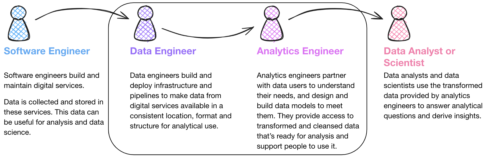

# Project Structure

**last updated:** 13/12/2024  
**dbt best practices version:** [v1.7](https://docs.getdbt.com/best-practices/how-we-structure/1-guide-overview)

# How we structure our create-a-derived-table projects

## 1-guide-overview

### What is Analytics Engineering?

Analytics Engineering is a relatively new function in the MoJ (as of November 2024). We sit in Data Modelling and Engineering Team (DMET), we are the 'Data Modelling' part! The title, [Analytics Engineer](https://www.getdbt.com/what-is-analytics-engineering) comes from the fact that we sit between Data Engineers on one side, who load the data onto our data warehouse; and Data Analysts (and other data users), who use the data on the other. There is a growing need for clean, standardised data that is consistent across the business and easy to use for any downstream users. That is where the Analytics Engineering function comes in. We aim to provide consistent, reusable data models conformed to common standards so that: 
- Analytical users (including Analysts, Statisticians and Data Scientists) can focus on analytical work instead of building their own pipelines
- Analytical users working in different parts of the organisation have consistent experiences when using data models
- Apparent discrepancies among numbers reported between different analytical teams are minimised

Here are some useful links if you want to do some further reading around Analytics Engineering:

- Analytics Engineering Government Digital and Data Profession Capability Framework ([GDD](https://ddat-capability-framework.service.gov.uk/role/analytics-engineer)). 

- [Blog post by dbt](https://www.getdbt.com/blog/analytics-engineer-vs-data-analyst)



### The guide

This guide aims to provide consistency in how our projects in create-a-derived-table are structured - in terms of folders, files and naming - all of which are related to how we structure our transformations.

As a group of Analytics Engineers, we have thoroughly reviewed guidance published by dbt (the software behind create-a-derived-table) and adapted it to suit our needs in this guide.

Please take the time to familiarise yourself with this project structure guide, and our [style guide](/tools/create-a-derived-table/style-guide), before starting projects in create-a-derived-table.

### Domains

The primary consideration relating to project structure is understanding which domain the table you want to create belongs to. In create-a-derived-table a domain should correspond to some service area or core business concept and is used to logically group databases. Domains are not mutually exclusive, so the same concepts can exist in different domains (different domains can deploy models to the same database!). A domain may be `people` relating HR and corporate, or `risk` relating to a justice system service user's safety, but it could be more or less granular if appropriate.

### Databases

The secondary consideration is whether the tables you are creating belong in an existing database, if they do, then this step is easy. If you need to create a new database then you'll need to decide which domain to put it in and what to call it. It's also possible to define a database across multiple domains. For example, a number of tables within your database might sit within 'domain a' while the rest sit in 'domain b'. This approach has the benefit of keeping all tables logically grouped within one database but will result in access to those tables being limited by the domain.

### Standard directory structure and naming conventions


Below is a simplified version of how we might expect the project structure of create-a-derived-table to look like. Throughout this guide we will provide examples of models based on real models that have been created for create-a-derived-table. These hopefully provide you with useful contextual examples that will build up an understanding of how we want the project to be structured and how your code should look.

- From the `mojap_derived_tables` dbt project, the hierarchy of directories must follow `models` -> `domain` -> `database`. The directory structure after this is arbitrary and can be chosen to suit your needs. However, we do recommend that you arrange your models into logical folders to make it easier for users to understand the code.
- Models (`.sql` files) must be named by the database and table they relate to separated by double underscores, i.e., `[database_name]__[table_name].sql`. This is because all models in the `models` directory must have a unique name.
- All staging models should live in the `staging` domain regardless of business / service area. This is to maintain visibility of the data being used on create-a-derived-table. Access should be given to databases within the staging domain, not the domain itself. 

Below is an overview of the whole create-a-derived-table folder structure. In the following sections we will go through each layer, covering in detail how we expect your project structure to look and our reasoning. 

```shell
├── mojap_derived_tables
  ├── dbt_project.yml
  └── models
      ├── sources # source domain
      │   ├── nomis.yml # model
      │   ├── oasys_prod.yaml
      │   ├── delius_prod.yaml
      │   ├── xhibit_v1.yaml
      │   ...
      │ 
      ├── staging  # staging domain
      │   ├── stg_nomis # database
      │   │      ├── stg_nomis__stg_docs.md # model
      │   │      ├── stg_nomis__stg_models.yml
      │   │      ├── stg_nomis__stg_offender.sql
      │   │      └── stg_nomis__stg_prison.sql
      │   └── stg_xhibit
      │          ├── _stg_xhibit.yml
      │          ├── stg_xhibit__stg_<model_names>.sql
      │          └── stg_xhibit__stg_court.sql
      ├── courts
      │   ├── criminal_courts_int
      │   │
      │   ├── criminal_courts_datamarts
      │   │
      │   └── criminal_courts_derived
      │
      ├── prison  # domain
      │   ├── prison_int # database
      │   │      ├──prison_int__int_<model_names>.sql # model
      │   │      ...
      │   ├── prison_datamarts
      │   │
      │   ├── prison_derived
```

### Models

Finally, you will begin designing / making your models. We suggest a medallion architecture that categorises the model you are making into three distinct layers, `staging`, `intermediate`, `datamarts` and `derived`. Where `datamarts` and `derived` are two halves of the same layer. Each layer represents data that is increasingly well understood, cleaned and standardised. 

The general rule as to what goes into each of these layers comes down to a few considerations. Staging generally is source specific and doesn't change the grain of the data. Then when you want to combine different sources, or change the grain of the data (or other more complicated transformations) then the models belongs in an intermediate database. Finally, the user facing models live in either `_datamarts` or `_derived` databases. The following sections will go into more depth about these categorisations as well as what the medallion architecture is. 

These concepts can be confusing, so if you have any further questions or just want to discuss you project use the [#ask-data-modelling](https://moj.enterprise.slack.com/archives/C03J21VFHQ9) slack channel to reach out. We are happy to answer questions or receive feedback about this guide there!

Finally, it is worth flagging that create-a-derived-table has been evolving since its conception and for that reason project structure guidance, style guidance and best practice have all changed on several occasions. So when you start looking around the code base on create-a-derived-table you may find that code style, project structure or naming conventions don't match the guidance here. It will be a continuos effort from all that use it to slowly conform create-a-derived-table.

## 2-staging

The staging layer is where our journey begins. This is the foundation of our project, where we bring all the individual components we're going to use to build our more complex and useful models into the project.

While dbt likes to use the analogy of quarks, molecules and atoms, we prefer to look at this like the stages of preparing a meal. We will use this throughout this guide as an aid in understanding what we are talking about. Within that framework, if our source system data are our raw ingredients, then you can think of the staging layer as the initial preparation of our meal, say chopping some vegetables. Later, we will come to combining the prepared raw ingredient (intermediate) and then bringing them together for different final meals (datamarts and derived). For more on this analogy, here is a good blog post about [toasted sandwiches](https://www.lightdash.com/blogpost/bi-for-the-semantic-layer).

### Staging: Files and folders

Let's zoom into the staging directory from our `models` file tree in the overview section and walk through what's going on here.

```shell
models/staging
├── stg_nomis
│   ├── stg_nomis__docs.md
│   ├── stg_nomis__models.yml
│   ├── stg_nomis__offender.sql
│   └── stg_nomis__prison.sql
└── stg_xhibit
    ├── stg_xhibit__models.yml
    └── stg_xhibit__court.sql
```

- **Folders.** Folder structure is extremely important in dbt. Not only do we need a consistent structure to find our way around the codebase, as with any software project, but our folder structure is also one of the key interfaces for understanding the knowledge graph encoded in our project (alongside the [DAG](https://en.wikipedia.org/wiki/Directed_acyclic_graph) and the data output into our warehouse). It should reflect how the data flows, step-by-step, from a wide variety of source-conformed models into fewer, richer business-conformed models. Moreover, we can use our folder structure as a means of selection in dbt [selector syntax](https://docs.getdbt.com/reference/node-selection/syntax). For example, with the above structure, if we got fresh xhibit data loaded and wanted to run all the models that build on our xhibit data, we can easily run `dbt build --select models/staging/xhibit_stg+`, and we’re all set for building more up-to-date reports on Crown Courts. Additionally, with create-a-derived-table the project structure is how we manage database access. So following this guidance will ensure only those who need to get to see your data get to see it.
  - ✅ **Subdirectories based on business grouping.** dbt recommends against this practice, however crate-a-derived-table has been built in a way that necessitates domains as subdirectories so that we can control access through [data engineering database access](https://github.com/moj-analytical-services/data-engineering-database-access/tree/main/database_access/create_a_derived_table). This is a key deviation from dbt guidance.
  - ✅ **Subdirectories based on the source system**. For the MoJ we have a staging domain and each subfolder in the domain will form its own database. We expect that each database in the staging domain should be source aligned. This allows for future projects to pull on data that is already staged, saving time and reducing the chance of silo-ing data.
  - ❌ **Subdirectories based on loader.** Some people attempt to group by how the data is loaded (like dlt, create-a-pipeline or data uploader), but this is too broad to be useful on a project of any real size.

- **File names.** Creating a consistent pattern of file naming is [crucial in dbt](https://docs.getdbt.com/blog/on-the-importance-of-naming). File names must be unique and correspond to the name of the model when selected and created in the warehouse. We recommend putting as much clear information into the file name as possible, including a prefix for the layer the model exists in, important grouping information, and specific information about the entity or transformation in the model.
  - ✅ `stg_[source_name]__stg_[source_model_name]` - This is the standard way in create-a-derived-table that a staging model will be named. Broken down, we have the `stg_[source_name]`, this must match the database name that the model will be deployed. create-a-derived-table uses it in the back-end. It is also important to note that the double underscore (`__`) between the database name and the rest of the file name, this is required as part of the back end machinery and the double underscore can't be used in any other place in the file name. Then we have `__stg_`, this is less important as the model lives in a `stg_` database, however if you wish you can use it to signify that the model is a staging model. It is more important to use these distinctions if you have any `__base_` models in your staging database (more on base models below). Finally, we expect a staging model for each of the source models and therefore in the name you will need to make it clear which table this is staging.
  - ❌ `stg_[source_name]__[entity]s.sql` - Although it is recommended by dbt to follow this convention, where a double underscore is used between source system and entity, this will not work with create-a-derived-table. The naming convention in create-a-derived-table relies on the double underscore to distinguish between database and model names. Therefore, **you cannot use double underscores anywhere else in the name of a model**, this will result in an error when running the model. 
  - ❌ `stg_[entity].sql` - This might be specific enough at first, but will break down in time. Adding the source system into the file name aids in discoverability, and allows understanding where a component model came from even if you aren't looking at the file tree.
  - ❌**Plural.** dbt's stance is that SQL, and particularly SQL in dbt, should read as much like prose as we can achieve. As such, it is suggested that unless there’s a single order in your `orders` table, plural is the correct way to describe what is in a table with multiple rows. While we agree with this approach for analyst-facing models downstream, we believe the value in maintaining the exact naming of source tables for curation purposes outweighs a technical improvement in readability for back-end models.'

### Staging: Models

Now that we’ve got a feel for how the files and folders fit together, let’s look inside one of these files and dig into what makes for a well-structured staging model.

Below, is an example of a standard staging model from one of our projects (from `sop_finance_stg__hmpps_general_ledger` model) that illustrates the common patterns within the staging layer. We’ve organised our model into two <Term id='cte'>CTEs</Term>: one pulling in a source table via the [source macro](https://docs.getdbt.com/docs/build/sources#selecting-from-a-source) and the other applying our transformations.


Here we have ordered the fields based on their type, however, you may decide to order your columns differently. See our [style guide](/tools/create-a-derived-table/style-guide) for more details on how you should style your models.

```sql
-- sop_finance_stg__base_hmpps_general_ledger.sql
source as (

    select * from {{ source('sop_finance_stg', 'hmpps_general_ledger') }}

),

renamed as (

    select

        ----------  ids
        {{ dbt_utils.generate_surrogate_key(
          ['id', 
          'a_id', ]) }} as cost_centre_analysis_code_id, -- primary key
        id as cost_centre_id, -- natural key
        a_id as analysis_code_id,
        objective as objective_code_id,

        ---------- strings
        extract_version

        ---------- numerics
        cast(debit_amount / 100.0) as float) as debit_amount,
        cast(credit_amount / 100.0) as float) as credit_amount,
        cast(total_amount / 100.0) as float) as total_amount,
        ---------- booleans
        is_recoverable,

        ---------- dates
        date(paid_date) as paid_date,

        ---------- timestamps
        transction_created_at

    from source

)

select * from renamed
```

- Based on the above, the most standard types of staging model transformations are:
  - ✅ **Renaming**
  - ✅ **Type casting**
  - ✅ **Basic computations** (e.g. cents to dollars)
  - ✅ **Categorizing** (using conditional logic to group values into buckets or booleans, such as in the `case when` statements above)
  - ✅ **Generating keys** Create unique surrogate keys using the dbt utils function `dbt_utils.generate_surrogate_key(`
  - ❌ **Joins** — the goal of staging models is to clean and prepare individual source-conformed concepts for downstream usage. We're creating the most useful version of a source system table, which we can use as a new modular component for our project. In our experience, joins are almost always a bad idea here — they create immediate duplicated computation and confusing relationships that ripple downstream — there are occasionally exceptions though.
  - ❌ **Aggregations** — aggregations entail grouping, and we're not doing that at this stage. Remember - staging models are your place to create the building blocks you’ll use all throughout the rest of your project — if we start changing the grain of our tables by grouping in this layer, we’ll lose access to source data that we’ll likely need at some point. We just want to get our individual concepts cleaned and ready for use, and will handle aggregating values downstream.
- ✅ **Materialised as views.** Looking at a partial view of our `dbt_project.yml` below, we can see that we’ve configured the entire staging directory to be materialised as <Term id='view'>views</Term>. As they’re not intended to be final artefacts themselves, but rather building blocks for later models, staging models should typically be materialised as views for two key reasons:

  - Any downstream model (discussed more in [marts](/best-practices/how-we-structure/4-marts)) referencing our staging models will always get the freshest data possible from all the component views it’s pulling together and materialising
  - It avoids wasting space in the warehouse on models that are not intended to be queried by data consumers, and thus do not need to perform as quickly or efficiently

    ```yaml
    # dbt_project.yml
    mojap_derived_talbes:
      models:
          staging:
            +materialised: view
    ```
>**💡 TIP**  
>During development of a data model, it may be useful to materialise all your models as tables. > This will allow you to more easily debug issues. When you are ready to merge your work with main then you > > can change the materialisation back to view.
 
- Staging models are the only place we'll use the [`source` macro](/docs/build/sources), and our staging models should have a 1-to-1 relationship to our source tables. That means for each source system table we’ll have a single staging model referencing it, acting as its entry point — _staging_ it — for use downstream.

- In MoJ many of our source datasets are 'curated tables' materialised by data engineers using create-a-derived-table. This means instead of using the standard source macro to pull data into our staging models, we should employ the transform_table.ref_on_prod macro.

```sql
-- stg_delius__address.sql

with

source as (

    select * from {{ transform_table.ref_on_prod('delius__address') }}

)

select * from source
```

In the dev environment (local runs / PR actions) [ref_on_prod](https://github.com/moj-analytical-services/create-a-derived-table/blob/main/transform_table/macros/utils/ref_on_prod.sql) macro operates equivalent to sourcing, meaning we don't need to rebuild the whole upstream pipeline to run our dependencies nor define curated models as sources. Conversely - and as the name suggests - in prod the macro [refs](https://docs.getdbt.com/reference/dbt-jinja-functions/ref) the curated model; this allows dbt to build an appropriate dependency graph as part of the production deployment.

>**💡 TIP**  
>Don’t Repeat Yourself. Staging models help us keep our code <Term id='dry'>DRY</Term>. dbt's modular, reusable structure means we can, and should, push any transformations that we’ll always want to use for a given component model as far upstream as possible. This saves us from potentially wasting code, complexity, and compute doing the same transformation more than once. For instance, if we know we always want our monetary values as floats in dollars, but the source system is integers and cents, we want to do the division and type casting as early as possible so that we can reference it rather than redo it repeatedly downstream.

We have decided to split all staging models into a single staging domain for several reasons. First, this creates a clear separation from the source data and the derived downstream models using that data. We do not want to silo the data too early, sources are not always domain aligned, we want to allow for different domains to use the same staging models. This brings us to a key point, all downstream models using data from the same source should use the same staging models. This reduces duplication of work and data stored in the data warehouse. It also ensures that those downstream models that do use the same source data will diverge at the latest possible point and therefore reducing differences in the data.

This is a welcome change for many of us who have become used to applying the same sets of SQL transformations in many places out of necessity! For us, the earliest point for these 'always-want' transformations is the staging layer, the initial entry point in our transformation process. The DRY principle is ultimately the litmus test for whether transformations should happen in the staging layer. If we'll want them in every downstream model, and they help us eliminate repeated code, they're probably okay.

### Staging: Other considerations

- **Base models** Generally, the staging layer is very simple, with few models (as many models as there are source tables). Sometimes, in order to maintain a clean and <Term id='dry'>DRY</Term> staging layer we need to implement some more complicated transformations. In these cases, we recommend creating a sub-directory in the staging directory for the source system in question and building `base` models. Base models are the normal non-joining transformations that directly source the raw data, but we have separated them out so that it is then clear where the source data first enters our staging database, and then they can be used for the more complicated transformations. Here are some examples of why you might use base models:

  - ✅ **First staging model** There is little distinction between a base model and a staging model when no further transformations are required in your staging database. So it is preference what you call these models, `base_` or `stg_`. In some domains, data engineers load the data without casting data types and then create a base model for that table in create-a-derived-table that casts and renames variables. Example below for illustration.

```sql
with

source as (

    select *
    , {{ dbt_utils.generate_surrogate_key(['user_s_fullname','employee_number','course_name','completion_status','mojap_file_date']) }} as training_course_activity_id
    from {{ source("corporate_my_learning", "training__course_activity")}}

),

numbered as (

    select *
      , row_number() over (partition by training_course_activity_id order by mojap_timestamp desc) as row_num
    from source

),

deduplicated as (

    select * from numbered where row_num = 1
    
),

final as (

    select
      training_course_activity_id,
      cast(lower(user_s_fullname) as varchar) as user_full_name,
      cast(employee_number as varchar) as employee_number,
      cast(user_s_organisation_name_s_ as varchar) AS user_organisation_name,
      cast(region as varchar) as region,
      cast(user_s_position_name_s_ as varchar) as user_position_name,
      cast(course_name as varchar) as course_name,
      cast(completion_status as varchar) as completion_status,
      date(date_parse(the_completion_date, '%d %b %Y')) as course_completion_date,
      date(date_parse(course_start_date, '%d %b %Y')) as course_start_date,
      cast(lower(user_s_manager_name_s_) as varchar) as user_manager_name,
      cast(user_status as varchar) as user_status,
      cast(mojap_timestamp as timestamp) as mojap_timestamp,
      cast(mojap_file_date as date) as mojap_file_date
  from deduplicated
  
)

select * from final
```

  - ✅ **Joining in separate delete tables**. Sometimes a source system might store deletes in a separate table. Typically, we’ll want to make sure we can mark or filter out deleted records for all our component models, so we’ll need to join these delete records up to any of our entities that follow this pattern. We will therefore create base models for all the source tables and then use a staging table to remove the deleted record by joining the base models together. Example below for illustration.

    ```sql
    -- base_xhibit_curated__defendant.sql

    with

    source as (

        select * from {{ source('xhibit_curated','defendant') }}

    ),

    defendants as (

        select
            id as defendant_id,
            first_name,
            last_name,
            dob as date_of_birth

        from source

    )

    select * from defendants
    ```

    ```sql
    -- base_xhibit_curated__deleted_defndants.sql

    with

    source as (

        select * from {{ source('xhibit_curated','deleted_defendant') }}

    ),

    deleted_defendants as (

        select
            id as defendant_id,
            deleted as deleted_at

        from source

    )

    select * from deleted_defendants
    ```

    ```sql
    -- stg_xhibit_curated__defendants.sql

    with

    defendants as (

        select * from {{ ref('base_xhibit_curated__defendant') }}

    ),

    deleted_defendants as (

        select * from {{ ref('base_xhibit_curated__deleted_defendants') }}

    ),

    join_and_mark_deleted_defendants as (

        select
            defendants.*,
            case
                when deleted_defendants.deleted_at is not null then true
                else false
            end as is_deleted

        from defendants

        left join deleted_defendants on 
          defendants.defendants_id = deleted_defendants.defendants_id

    )

    select * from join_and_mark_deleted_defendants
    ```

  - ✅ **Unioning disparate but symmetrical sources**. A typical example here would be if you operate multiple ecommerce platforms in various territories via a SaaS platform like Shopify. You would have perfectly identical schemas, but all loaded separately into your warehouse. In this case, it’s easier to reason about our orders if _all_ of our shops are unioned together, so we’d want to handle the unioning in a base model before we carry on with our usual staging model transformations on the (now complete) set. With MoJ data, you may expect to see this, for example, in finance data. Finance data may come from separate business units (HMCTS, MOJHQ, HMPPS etc). If this source data is structured the same but separated out into business unit specific table and the downstream transformations for each business unit is the same, you may wish to union these in your staging layer — you can dig into [more detail on this use case here](https://discourse.getdbt.com/t/unioning-identically-structured-data-sources/921).
  - ✅ Denormalising source tables of the same grain and concept (e.g. reference tables)

- **[Codegen](https://github.com/dbt-labs/dbt-codegen) to automate staging table generation.** It’s very good practice to learn to write staging models by hand, they’re straightforward and numerous, so they can be an excellent way to absorb the dbt style of writing SQL. Also, we’ll invariably find ourselves needing to add special elements to specific models at times — for instance, in one of the situations above that require base models — so it’s helpful to deeply understand how they work. Once that understanding is established though, because staging models are built largely following the same rote patterns and need to be built 1-to-1 for each source table in a source system, it’s preferable to start automating their creation. For this, we have the [codegen](https://github.com/dbt-labs/dbt-codegen) package. This will let you automatically generate all the source YAML and staging model boilerplate to speed up this step, and we recommend using it in every project.
- **Utilities folder.** While this is not in the `staging` folder, it’s useful to consider as part of our fundamental building blocks. The `models/utilities` directory is where we can keep any general purpose models that we generate from macros or based on seeds that provide tools to help us do our modelling, rather than data to model itself. The most common use case is a [date spine](https://github.com/dbt-labs/dbt-utils#date_spine-source) generated with [the dbt utils package](https://hub.getdbt.com/dbt-labs/dbt_utils/latest/).

**:::info Development flow versus DAG order.** This guide follows the order of the DAG, so we can get a holistic picture of how these three primary layers build on each other towards fuelling impactful data products. It’s important to note though that developing models does not typically move linearly through the DAG. Most commonly, we should start by mocking out a design so we know we’re aligned with our stakeholders on output goals. Then, we’ll want to write the SQL to generate that output, and identify what tables are involved. Once we have our logic and dependencies, we’ll make sure we’ve staged all the necessary atomic pieces into the project, then bring them together based on the logic we wrote to generate our mart. Finally, with a functioning model flowing in dbt, we can start refactoring and optimizing that mart. By splitting the logic up and moving parts back upstream into intermediate models, we ensure all of our models are clean and readable, the story of our DAG is clear, and we have more surface area to apply thorough testing. **:::**

## 3-intermediate

Now that we have prepared out ingredients, we will want to start combining them to make more complex, intricate recipes. The intermediate layer is where these combined creations live, creating varied forms with specific purposes on the way towards the more complex dishes and meals.

### Intermediate: Files and folders

Let’s take a look at the intermediate layer of our project to understand the purpose of this stage more concretely.

```shell
models
└── criminal_courts
    └── criminal_courts_int
        ├── criminal_courts_int_properties.yml
        └── criminal_courts_int__int_xhibit_and_common_platform_receipts_unioned.sql
```

- **Folders**
  - ✅ **Subdirectories based on business groupings.** Much like the staging layer, we’ll house this layer of models inside their own `_int` database. Unlike the staging layer, here we shift towards being business-conformed, splitting our models up into subdirectories not by their source system, but by their area of business concern.
- **File names**
  - ✅ `int_[entity]s_[verb]s.sql` - the variety of transformations that can happen inside the intermediate layer makes it harder to dictate strictly how to name them. The best guiding principle is to think about _verbs_ (e.g. `pivoted`, `aggregated_to_user`, `joined`, `fanned_out_by_quantity`, `funnel_created`, etc.) in the intermediate layer. In our example model below, we have financial data that corresponds to specific extract periods, we want to pivot it, so all forecast information for each period is on one row `finance_int__int_hyperion_forecast_pivot`. It’s easy for anybody to quickly understand what’s happening in that model, even if they don’t know [SQL](https://mode.com/sql-tutorial/). That clarity is worth the long file name. 
  - ✅ `[database_name]__int_[entity]s_[verb]s.sql` - create-a-derived-table requires us to include the database in all model names, or if `int_[entity]s` is the database name then `int_[entity]s__[verb]s.sql`. Due to this requirement, **you cannot use double underscores anywhere else in your filenames**.

### Intermediate: Models

Below is a slightly more complicated model taken from a finance project. This represents an excellent use case per our principles above, serving a clear single purpose: pivoting a staging model to different grain. It utilises a bit of Jinja in the form of a macro to make the model DRY-er (striving to be DRY applies to the code we write inside a single model in addition to transformations across the codebase), but don’t be intimidated if you’re not quite comfortable with [Jinja](/docs/build/jinja-macros) yet. Looking at the name of the <Term id="cte">CTE</Term>, `finance_int__int_hyperion_forecast_pivot` we get a clear idea of what’s happening inside this block. By descriptively labelling the transformations happening inside our CTEs within our model, just as we do with our files and folders, even a stakeholder who doesn’t know SQL would be able to grasp the purpose of this section, if not the code. As you begin to write more complex transformations moving out of the staging layer, keep this idea in mind. In the same way our models connect into a DAG and tell the story of our transformations on a macro scale, CTEs can do this on a smaller scale inside our model files.

```sql
-- finance_int__int_hyperion_forecast_pivoted.sql

-- Aim of model
-- Pivot from one row per code combination, per month, per extract timestamp
-- to one row per code combination per calender year.

with 

hyperion as (

    select * from {{ ref('finance_int__int_hyperion_metrics_snapshotted') }}

),

pivot as (

    select 

        {{ dbt_utils.generate_surrogate_key(
            ['objective_code', 
            'cost_centre_code', 
            'entity_code', 
            'analysis_code',
            'account_code',
            'financial_year',
            'month']) 
        }} as forecast_metric_id,
        objective_code,
        cost_centre_code,
        entity_code,
        analysis_code,
        account_code,
        financial_year,
        month,
        month_number,

        {{ dbt_utils.pivot(
            'period', 
            ['p1', 'p2', 'p3', 'p4', 'p5', 'p6', 'p7', 'p8', 'p9', 'p10', 'p11', 'p12'],
            suffix = '_forecast',
            then_value='forecast') 
        }},
        {{ dbt_utils.pivot(
            'period', 
            ['p1', 'p2', 'p3', 'p4', 'p5', 'p6', 'p7', 'p8', 'p9', 'p10', 'p11', 'p12'],
            suffix = '_full_year_forecast',
            then_value='full_year_forecast') 
        }}

    from deduplicate
    where row_n = 1
    group by 1,2,3,4,5,6,7,8,9

)

select * from pivot
```

- ❌ **Exposed to end users.** Intermediate models should generally not be exposed in the main production schema. They are not intended for output to final targets like dashboards or applications, so it’s best to keep them separated from models that are, so you can more easily control data governance and discoverability.
- ✅ **Materialised ephemerally.** Considering the above, one popular option is to default to intermediate models being materialised [ephemerally](/docs/build/materializations#ephemeral). This is generally the best place to start for simplicity. It will keep unnecessary models out of your warehouse with minimum configuration. Keep in mind though that the simplicity of ephemerals does translate a bit more difficulty in troubleshooting, as they’re interpolated into the models that `ref` them, rather than existing on their own in a way that you can view the output of.
- ✅ **Materialised as views in a custom schema with special permissions.** A more robust option is to materialise your intermediate models as views in a specific [custom schema](/docs/build/custom-schemas), outside of your main production schema. This gives you added insight into development and easier troubleshooting as the number and complexity of your models grows, while remaining easy to implement and taking up negligible space.

>**💡 TIP**  
>Keep your warehouse tidy! There are three interfaces to the organisational knowledge graph we’re encoding into dbt: the DAG, the files and folder structure of our codebase, and the output into the warehouse. As such, it’s really important that we consider that output intentionally! Think of the schemas, tables, and views we’re creating in the warehouse as _part of the UX,_ in addition to the dashboards, ML, apps, and other use cases you may be targeting for the data. Ensuring that our output is named and grouped well, and that models not intended for broad use are either not materialised or built into special areas with specific permissions is crucial to achieving this.

- Intermediate models’ purposes, as these serve to break up complexity from our datamarts models, can take as many forms as [data transformation](https://www.getdbt.com/analytics-engineering/transformation/) might require. Some of the most common use cases of intermediate models include:

  - ✅ **Structural simplification.** Bringing together a reasonable number (typically 4 to 6) of entities or concepts (staging models, or perhaps other intermediate models) that will be joined with another similarly purposed intermediate model to generate a mart — rather than have 10 joins in our mart, we can join two intermediate models that each house a piece of the complexity, giving us increased readability, flexibility, testing surface area, and insight into our components.
  - ✅ **Re-graining.** Intermediate models are often used to fan out or collapse models to the right composite grain — if we’re building a mart for `order_items` that requires us to fan out our `orders` based on the `quantity` column, creating a new single row for each item, this would be ideal to do in a specific intermediate model to maintain clarity in our mart and more easily view that our grain is correct before we mix it with other components.
  - ✅ **Isolating complex operations.** It’s helpful to move any particularly complex or difficult to understand pieces of logic into their own intermediate models. This not only makes them easier to refine and troubleshoot, but simplifies later models that can reference this concept in a more clearly readable way. For example, in the example above, we isolate the pivoting of the data into one model, which allows us to quickly debug and thoroughly test that transformation, and downstream models can reference forecasting metrics in a way that’s intuitively easy to grasp.
  - ✅ **Creating a dbt `Relation` object.** dbt packages such as [dbt-utils](https://github.com/dbt-labs/dbt-utils) often require reference to a dbt [Relation](https://docs.getdbt.com/reference/dbt-classes#relation). Intermediate models can be used to materialise a `Relation` to input specific data into a downstream macro.

>**💡 TIP**  
>Narrow the DAG, widen the tables. Until we get to the marts layer and start building our various outputs, we ideally want our DAG to look like an arrowhead pointed right. As we move from source-conformed to business-conformed, we’re also moving from numerous, narrow, isolated concepts to fewer, wider, joined concepts. We’re bringing our components together into wider, richer concepts, and that creates this shape in our DAG. This way when we get to the marts layer we have a robust set of components that can quickly and easily be put into any configuration to answer a variety of questions and serve specific needs. One rule of thumb to ensure you’re following this pattern on an individual model level is allowing multiple _inputs_ to a model, but **not** multiple _outputs_. Several arrows going _into_ our post-staging models is great and expected, several arrows coming _out_ is a red flag. There are absolutely situations where you need to break this rule, but it’s something to be aware of, careful about, and avoid when possible.

## 4-datamarts

### Datamarts: Introduction

Here is where everything comes together, where all the previous preparation brought together to make meals with well-defined identity and purpose. This is also where, normally, the end user will see the data. For this reason a lot of thought has been put into the naming conventions we want to abide by in the MoJ. This guidance document has come after many years of iteratively changing and improving our processes in the Data Modelling and Engineering team, as well as across Data and Analysis. We have therefore put a lot of thought into how we can clearly signify the different kinds of databases that will be and have already been developed, and who they have been developed by. In the following two sections (datamarts and then derived) we will lay out what we expect from a project and how we see the categorisation of these pieces of work.

This will likely be where we deviate most from dbt as we want to tailor our solution to our business needs. Generally, we see the datamarts database as the place your customers should come to get the most fundamental building blocks of the data. It is the first place the end user will have access to the data and any downstream product or pipeline that wishes to use your data should use these building blocks. In Analytics Engineering we have been following the [Kimball methodology](https://www.kimballgroup.com/data-warehouse-business-intelligence-resources/kimball-techniques/) and have been developing [dimensional models](https://docs.getdbt.com/blog/kimball-dimensional-model) as our datamarts layer. Users can either connect to the datamarts database directly with their dashboards or models, or they can combine the building blocks to more uniquely satisfy their needs (see 5-derived). 

We are taking this approach as we wish there to be 'one source of truth', allowing for the analysis that comes from it to be consistent and reliable. To achieve this we will treat code and pull requests on create-a-derived-table differently depending on their purpose. It is a requisite for any code being added to create-a-derived-table to be reviewed by an Analytics Engineer (and a Data Engineer if it changes any project related files). If you wish for you code to be in the derived layer and therefore be suffixed with `_derived`, then we will do the core review ensuring that the code meets our style standards and the project structure follows this guidance. We will make sure it passes any PR checks, but we will expect you to have reviewed and checked the logic and code within your team and will not be checking it ourselves. If you think your work is general enough and requires a datamarts layer then before you start your project, you should contact the Analytics Engineers on slack, where we can set up a meeting and discuss how to go forward. For more on the sort of things we look for in PRs, and what sort of projects goes where, go to our ⚠️ Guidance still in progress [PR guidance](/tools/create-a-derived-table/pull-request-guidance) ⚠️. 

### Datamarts: Files and folders

```shell
models/prison
├── prisons_datamarts
│   ├── prisons_datamarts.yml
│   ├── prisons_datamarts__fct_releases.sql
│   ├── prisons_datamarts__dim_offenders.sql
│   ├── prisons_datamarts__dim_prisons.sql
└── parole_board_datamarts
    ├── parole_board_datamarts.yml
    └── parole_board_datamarts__fct_cases.sql
    └── parole_board_datamarts__dim_directions.sql
```

✅ **Facts and dimensions** These are the building blocks developed by or with oversight by Analytics Engineers that can be used to create any downstream output. They are designed to serve a range of business needs. 

❌ **Flatfiles and denormalised tables** Any product that requires more specific and specialised tables should not live in the datamarts layer. They should live in the derived layer, more details can be found in the next section.

- **fct_<verb>**: Fact tables are long, narrow tables representing real-world processes that have occurred or are occurring. The heart of these models is usually records of events that once happened do not change, but are superseded by future events. Examples: sessions, transactions, orders, stories, votes.
- **dim_<noun>**: Dimension tables are wide, short tables where each row is a person, place, or thing; the ultimate source of truth when identifying and describing entities of the organisation. These rows can change over time, though slowly changing: customers, defendants, candidates, buildings, employees, offences. For example an offenders name may change while in prison and be updated on the source system, we would want this to be reflected in the data. We want to know what the most current information for a particular row is, but also have the ability to see what it was at a given time in the past. 

✅ **Group by domain or area of concern.** On create-a-derived-table datamarts will be organised into domains, these align with general business areas (criminal courts, finance, prisons, people, etc.). Within each domain the subfolder will represent the database name and should reflect a business area concept (crown court for criminal courts or recruitment for people). We are no longer interested in strictly source aligned concepts.

✅ **Name by entity.** Use plain English to name the file based on the concept that forms the grain of the mart `sentences`, `offenders`. Note that for pure datamarts, there should not be a time dimension (`orders_per_day`) here, that is typically best captured via metrics.

❌ **Build the same concept differently for different teams.** `finance_orders` and `marketing_orders` is typically considered an anti-pattern. There are, as always, exceptions — a common pattern we see is that, finance may have specific needs, for example reporting revenue to the government in a way that diverges from how the company as a whole measures revenue day-to-day. Just make sure that these are clearly designed and understandable as _separate_ concepts, not departmental views on the same concept: `tax_revenue` and `revenue` not `finance_revenue` and `marketing_revenue`.

### Datamarts: Complete Enterprise Data Warehouse approach using create-a-derived-table


In the above diagram you can see the flow of data through the Data Modelling and Engineering function. This follows a medallion rating system, that corresponds to the level of cleaning, transforming and testing that has been implemented on the data. 

🥉 Bronze databases, signified by a `_raw` suffix, has very minimal transforming, cleaning or testing. The Data Engineers aim at this point is to ensure that the source data has been loaded on to the Analytical Platform in the exact form that they have received it. 

🥈 Silver databases, signified by `_curated` or maybe `_base` in some instances, start once the data is successfully loaded to the AP. After this basic transformations are performed, things like validations, deduplication and versioning. 

🥇 Gold databases, signified by `_datamarts` or `_derived`, are the final stage of the transformations performed by DMET and are also the most involved. We have split the gold level into two parts to distinguish work that has been done by Analytics Engineers or overseen by them, and has followed the Kimball methodology. Or, databases that have been developed outside DMET and serve more specific business needs.

### Datamarts: Models

Finally, we’ll take a look at the best practices for models within the marts directory by examining two example marts models. These are the business-conformed — that is, crafted to our vision and needs — entities we’ve been bringing these transformed components together to create. Models in the datamarts layer can be very simple select statements, or could be slightly more complicated joins:


```sql
--finance_datamarts__dim_hmpps_local_cost_centres

with

cost_centres as (

  select * from {{ ref('finance_stg__stg_hmpps_local_cost_centres') }}

)

select * from cost_centres
```


```sql
--finance_datamarts__fct_hmpps_hyperion_metrics

with

full_extract as (

    select * from {{ ref('finance_int__int_hyperion_metrics_dashboard_formatting') }}
    
),

lookup as (

    select * from {{ ref('lookup_finance_stg__base_cost_centre_codes') }}

),

select_business_area as (

    select 
        full_extract.*
    from full_extract 
    left join lookup 
        on full_extract.cost_centre_code = lookup.cost_centre_code
    where lookup.company = 'NOMS'

)

select * from select_business_area
```

- ✅ **Materialised as tables or incremental models.** Once we reach the datamarts layer, it’s time to start building not just our logic into the warehouse, but the data itself. This gives end users much faster performance for these later models that are actually designed for their use, and saves us costs recomputing these entire chains of models every time somebody refreshes a dashboard or runs a regression in python. A good general rule of thumb regarding materialisation is to always start with a view (as it takes up essentially no storage and always gives you up-to-date results), once that view takes too long to practically _query_, build it into a table, and finally once that table takes too long to _build_ and is slowing down your runs, [configure it as an incremental model](https://docs.getdbt.com/docs/build/incremental-models/). As always, start simple and only add complexity as necessary. The models with the most data and compute-intensive transformations should absolutely take advantage of dbt’s incremental materialisation options, but rushing to make all your marts models incremental by default will introduce superfluous difficulty. We recommend reading this [post on the limits of incremental modelling](https://discourse.getdbt.com/t/on-the-limits-of-incrementality/303).
- ❌ **Too many joins in one mart.** One good rule of thumb when building dbt transformations is to avoid bringing together too many concepts in a single mart. What constitutes ‘too many’ can vary. If you need to bring 8 staging models together with nothing but simple joins, that might be fine. Conversely, if you have 4 concepts you’re weaving together with some complex and computationally heavy window functions, that could be too much. You need to weigh the number of models you’re joining against the complexity of the logic within the mart, and if it’s too much to read through and build a clear mental model of then look to modularise. While this isn’t a hard rule, if you’re bringing together more than 4 or 5 concepts to create your mart, you may benefit from adding some intermediate models for added clarity. Two intermediate models that bring together three concepts each, and a mart that brings together those two intermediate models, will typically result in a much more readable chain of logic than a single mart with six joins.
- ✅ **Build on separate marts thoughtfully.** While we strive to preserve a narrowing DAG up to the marts layer, once here things may start to get a little less strict. A common example is passing information between marts at different grains, for example, to aggregate data into the grain of another mart. Now that we’re really ‘spending’ compute and storage by actually building the data in our outputs, it’s sensible to leverage previously built resources to speed up and save costs on outputs that require similar data, versus recomputing the same views and CTEs from scratch. The right approach here is heavily dependent on your unique DAG, models, and goals — it’s just important to note that using a mart in building another, later mart is okay, but requires careful consideration to avoid wasted resources or circular dependencies.

### Datamarts: Other considerations

- **Troubleshoot via tables.** While stacking views and ephemeral models up until our marts — only building data into the warehouse at the end of a chain when we have the models we really want end users to work with — is ideal in production, it can present some difficulties in development. Particularly, certain errors may seem to be surfacing in our later models that actually stem from much earlier dependencies in our model chain (ancestor models in our DAG that are built before the model throws the errors). If you’re having trouble pinning down where or what a database error is telling you, it can be helpful to temporarily build a specific chain of models as tables so that the warehouse will throw the error where it’s actually occurring.

## 5-derived

### Derived: Introduction

The final layer in the DMET pipeline, as shown in the figure in the previous section, is the derived layer. Following our analogy to its logical end, this is where our pre-prepared meals might live. Where those meals we come back to time and again, so we make them available. They are ready-to-go, so they don't need to be remade over and over again. This should include all databases downstream of the datamarts databases and will usually represent a specific business need that flattens dimensions and facts into fewer use specific tables. We also intend this to be home to any database that has been developed outside the direct oversight of Analytics Engineers. Given these databases will be more specialised to specific use cases we will therefore have fewer requirements on them to conform to data modelling concepts like those found in the Kimball methodology. Where possible the datamarts databases should be the source for these databases.

**Derived** tend to be wide, dense tables, the result of joining facts and dimensions into a single table ready-made for a particular analysis. In modern data warehousing — where storage is cheap and compute is expensive — we can borrow and add any and all data from dimensional concepts to answer questions about core entities. Building the same data in multiple places is more efficient in this paradigm than having to repeatedly rejoin these concepts in the dimensional layer.

### Derived: Database types

The two types of derived databases:
- **Analytics Engineering Managed:** These databases will be suffixed with `_derived' and will be named after relevant domains / sub-domain (i.e. probation, finance, recruitment, etc.). These databases will either be developed by, or with oversight from, Analytics Engineers. They will be considered gold standard in the medallion architecture. 
- **All other tables databases:** Create-a-derived-table is designed to be used by anyone who wants to use it. The previous few chapters have outlined how we expect projects to be structured, however, it can be used by anyone to create products that are useful to them, providing they meet some core rules:
  - It doesn't duplicate work already done.
  - It passes the standard PR checks and has been reviewed by an Analytics Engineer (and a Data Engineer if necessary). This may mean that you are asked to make changes to you project if someone in DMET thinks that your project could interfere with existing work.
  - You do your best to branch of current data products at the latest possible point in the data pipeline. This is to reduce divergence and ensures that we are all working from the same 'one source of truth'.

### Derived: Database Access

Access to derived table will likely need to be granted on a database level, rather than on a domain level. This will require relevant configs in Database Access to be set up. For further detail go to [#ask-data-modelling](https://moj.enterprise.slack.com/archives/C03J21VFHQ9) to get advise on how to get access or set up access.

## 6-the-rest-of-the-project

So far we’ve focused on the `models` folder, the primary directory of our dbt project. Next, we’ll zoom out and look at how the rest of our project files and folders fit in with this structure, starting with how we approach YAML configuration files.

```shell
├── mojap_derived_tables
  ├── dbt_project.yml
  ├── models
  │   ├── sources # source domain
  │   │   ├── nomis.yaml # model
  │   │   ├── oasys_prod.yaml
  │   │   ├── delius_prod.yaml
  │   │   ├── xhibit_v1.yaml
  │   │   ...
  │   │ 
  │   ├── staging  # staging domain
  │   │   ├── stg_nomis # database
  │   │   │      ├── stg_nomis\_\_docs.md # model
  │   │   │      ├── stg_nomis\_\_models.yml
  │   │   │      ├── stg_nomis\_\_offender.sql
  │   │   │      └── stg_nomis\_\_prison.sql
  │   │   └── stg_xhibit
  │   │          ├── stg_xhibit\_\_models.yml
  │   │          └── stg_xhibit\_\_court.sql
  │   ├── courts # domain
  │   │   ├── criminal_courts_int # database
  │   │   │
  │   │   ├── criminal_courts_datamarts
  │   │   │
  │   │   └── criminal_courts_derived
  │   │
  │   ├── prison  # domain
  │   │   ├── prison_int # database
  │   │   │      ├──prison_int\_\_int_models.sql # model
  │   │   │      ...
  │   │   ├── prison_datamarts
  │   │   │
  │  ...
  ├── macros
  ├── model_templates
  ├── seeds
  ├── snapshots
  ├── target
  └── tests
```

### YAML in-depth

When structuring your YAML configuration files in a dbt project, you want to balance centralization and file size to make specific configs as easy to find as possible. It’s important to note that while the top-level YAML files (`dbt_project.yml`, `packages.yml`) need to be specifically named and in specific locations, the files containing your `sources` and `models` dictionaries can be named, located, and organised however you want. It’s the internal contents that matter here. As such, we’ll lay out our primary recommendation, as well as the pros and cons of a popular alternative. Like many other aspects of structuring your dbt project, what’s most important here is consistency, clear intention, and thorough documentation on how and why you do what you do.

- ✅ **Config per folder.** As in the example above, create a `_[directory]__models.yml` per directory in your models folder that configures all the models in that directory.
  - The leading underscore ensures your YAML files will be sorted to the top of every folder to make them easy to separate from your models.
  - YAML files don’t need unique names in the way that SQL model files do, but including the directory (instead of simply `_sources.yml` in each folder), means you can fuzzy find the right file more quickly.
  - dbt has recommended several naming conventions over the years, most recently calling these `schema.yml` files. They have now simplified to recommend that these simply be labelled based on the YAML dictionary that they contain.
  - If you utilise [doc blocks](https://docs.getdbt.com/docs/build/documentation#using-docs-blocks) in your project, we recommend following the same pattern, and creating a `_[directory]__docs.md` markdown file per directory containing all your doc blocks for that folder of models.
- ❌ **Config per project.** Some people put _all_ of their source and model YAML into one file. While you can technically do this, and while it certainly simplifies knowing what file the config you’re looking for will be in (as there is only one file), it makes it much harder to find specific configurations within that file. We recommend balancing those two concerns.
- ⚠️ **Config per model.** On the other end of the spectrum, some people prefer to create one YAML file per model. This presents less of an issue than a single monolith file, as you can quickly search for files, know exactly where specific configurations exist, spot models without configs (and thus without tests) by looking at the file tree, and various other advantages. In our opinion, the extra files, tabs, and windows this requires creating, copying from, pasting to, closing, opening, and managing creates a somewhat slower development experience that outweighs the benefits. Defining config per directory is the most balanced approach for most projects, but if you have compelling reasons to use config per model, there are definitely some great projects that follow this paradigm.
- ✅ **Cascade configs.** Leverage your `dbt_project.yml` to set default configurations at the directory level. Use the well-organised folder structure we’ve created thus far to define the baseline schemas and materialisations, and use dbt’s cascading scope priority to define variations to this. For example, as below, define your marts to be materialised as tables by default, define separate schemas for our separate subfolders, and any models that need to use incremental materialisation can be defined at the model level.

```yaml
-- dbt_project.yml

electronic_monitoring:
  +meta:
    dc_owner: matthew.price2
  ems_stg:
    +tags: em
  ems_int:
    +tags: em
finance:
  +meta:
    dc_owner: holly.furniss
  hyperion_finance_stg:
    +tags: monthly
  sop_finance_stg:
    +tags: monthly
  lookup_finance_stg:
    +tags: monthly
  finance_derived:
    +tags:
      - daily
      - dc_display_in_catalogue
```

>**💡 TIP**  
>Define your defaults. One of the many benefits this consistent approach to project structure confers to us is this ability to cascade default behaviour. Carefully organising our folders and defining configuration at that level whenever possible frees us from configuring things like schema and materialisation in every single model (not very DRY!) — we only need to configure exceptions to our general rules. Tagging is another area this principle comes into play. Many people new to dbt will rely on tags rather than a rigorous folder structure, and quickly find themselves in a place where every model _requires_ a tag. This creates unnecessary complexity. We want to lean on our folders as our primary selectors and grouping mechanism, and use tags to define groups that are _exceptions._ A folder-based selection like \*\*`dbt build --select marts.marketing` is much simpler than trying to tag every marketing-related model, hoping all developers remember to add that tag for new models, and using `dbt build --select tag:marketing`.

### How we use the other folders

```shell
moj_derived_tables
├── macros
│   ├── _macros.yml
│   └── cents_to_dollars.sql
├── model_templates
├── seeds
│   └── employees.csv
├── snapshots
├── target
└── tests
```

We’ve focused heavily so far on the primary area of action in our dbt project, the `models` folder. Below we wanted to cover the use of these folders and some considerations when working in them.

- ✅ `seeds` for lookup tables. The most common use case for seeds is loading lookup tables that are helpful for modelling but don’t exist in any source systems — think mapping postcodes to counties, or court codes to court meta data.
- ❌ `seeds` for loading source data. Do not use seeds to load data from a source system into your warehouse. If it exists in a system you have access to, you should be loading it with a proper EL tool into the raw data area of your warehouse. dbt is designed to operate on data in the warehouse, not as a data-loading tool.
- ✅ `tests` for testing multiple specific tables simultaneously. As dbt tests have evolved, writing singular tests has become less and less necessary. It's extremely useful for work-shopping test logic, but more often than not you'll find yourself either migrating that logic into your own custom generic tests or discovering a pre-built test that meets your needs from the ever-expanding universe of dbt packages (between the extra tests in [`dbt-utils`](https://github.com/dbt-labs/dbt-utils) and [`dbt-expectations`](https://github.com/calogica/dbt-expectations) almost any situation is covered). One area where singular tests still shine though is flexibly testing things that require a variety of specific models. If you're familiar with the difference between [unit tests](https://en.wikipedia.org/wiki/Unit_testing) [and](https://www.testim.io/blog/unit-test-vs-integration-test/) [integration](https://www.codecademy.com/resources/blog/what-is-integration-testing/) [tests](https://en.wikipedia.org/wiki/Integration_testing) in software engineering, you can think of generic and singular tests in a similar way. If you need to test the results of how several specific models interact or relate to each other, a singular test will likely be the quickest way to nail down your logic.
- ✅ `snapshots` for creating [Type 2 slowly changing dimension](https://en.wikipedia.org/wiki/Slowly_changing_dimension#Type_2:_add_new_row) records from [Type 1](https://en.wikipedia.org/wiki/Slowly_changing_dimension#Type_1:_overwrite) (destructively updated) source data. This is [covered thoroughly in the dbt Docs](/docs/build/snapshots), unlike these other folders has a more defined purpose, and is out-of-scope for this guide, but mentioned for completion.
- ✅ `macros` for DRY-ing up transformations you find yourself doing repeatedly. Like snapshots, a full dive into macros is out-of-scope for this guide and well [covered elsewhere](/docs/build/jinja-macros), but one important structure-related recommendation is to [write documentation for your macros](https://docs.getdbt.com/faqs/docs/documenting-macros). We recommend creating a `_macros.yml` and documenting the purpose and arguments for your macros once they’re ready for use.
- ✅ `target` although we don't explicitly use the target folder and you should never save anything directly to it, it is a great place to go when debugging code. The target folder is where the 'compiled' models are saved. This is the sql code that is generated by dbt once all the macros have been filled with real code. This means it is a great place to find the actual code dbt is running, you can then copy it into athena and see why your code isn't running properly.
- ✅ `model_templates` these templates are generic templates created by data engineering for snapshotting and slowly changing dimension models. You can use these in you projects if you have the need for them.
