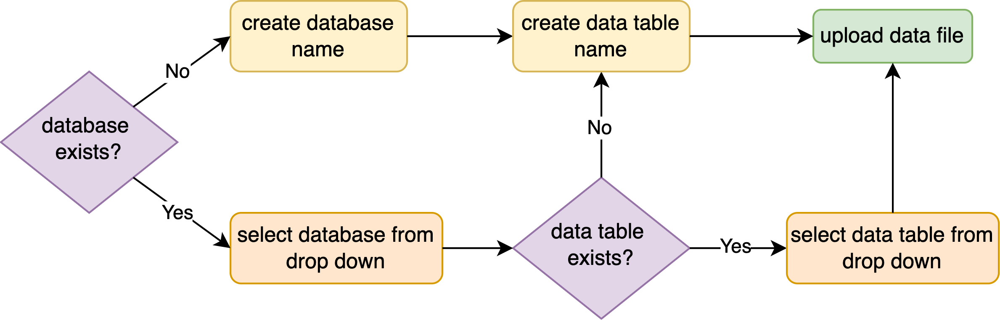

# Data Uploader

Quickstart link to the production deployment [Uploader](https://data-eng-uploader-prod.apps.live.cloud-platform.service.justice.gov.uk/). We have had problems with firefox; please use an alternate browser.

- [Why use the Uploader?](#why-use-the-uploader)
- [Uploader flowchart ](#uploader-flowchart)
- [Data Uploader pre-requisites](#data-uploader-pre-requisites)
- [Login page](#login-page)
- [Front page](#front-page)
- [Step 1 of 4: Data governance requirements ](#step-1-of-4-data-governance-requirements)
- [Step 2 of 4: Choose database](#step-2-of-4-choose-database)
- [Step 3 of 4: Choose table](#step-3-of-4-choose-table)
- [Step 4 of 4: Check your inputs before uploading your data](#step-4-of-4-check-your-inputs-before-uploading-your-data)
- [Upload complete](#upload-complete)
- [Getting access to uploaded data](#getting-access-to-uploaded-data)
- [Troubleshooting](#troubleshooting)
- [Limitations and awareness](#limitations-and-awareness)

## Why use the Uploader?

The Uploader is aimed at colleagues who have data not already on the MoJ Analytical Platform and wish to upload them there to be able to apply Analytical Platform tools, such as Athena. Only tables created from this tool can be added to from this tool.

## Uploader flowchart

Data is stored in the S3 bucket in an SQL like structure with one or more databases at the top level, each of which may contain one or more data tables. If the database or data table already exists it will be available to choose in a drop down list, if not it must be created.

When subsequent new data files are added to a data table they will be stored as separate partitions of that data table, and any schema changes will be represented in the final table as a union of every partition.

**Note: the existing permissions infrastructure allows anyone with access to the Uploader to append data to _any_ existing table, however, you can only _view_ data you have permssion for.** For example, if you accidentally upload data to the wrong table, anyone with permission to view that table will be able to access your data. Please check that the table selected for the data upload is correct to avoid granting view access to unauthorised persons.

Automated validation is applied to the data pre upload to check the basics - there are checks that column names exist and are in the character set `[A-Za-z0-9_]`.

## Data Uploader pre-requisites
- In order to utilise the data uploader, you are required to do a pull request. This can be done via [this github page](https://github.com/ministryofjustice/analytical-platform-uploader/blob/main/application/users/uploader_users_prod.yaml) and then adding your email to the users list.  If your github user is unable to create a pull request you may need to be added to https://github.com/ministryofjustice then you can SSO into the ministryofjustice organisation [here](https://github.com/orgs/ministryofjustice/sso)

- Next you will need to get access to the [DPIA](https://intranet.justice.gov.uk/guidance/knowledge-information/protecting-information/privacy-reform/data-protection-impact-assessments-dpias/) (Data Protection Impact Assessment) or an [MOJ analytical platform data movement Form](https://forms.office.com/Pages/ResponsePage.aspx?id=KEeHxuZx_kGp4S6MNndq2I8ebMaq5PFBoMAkkhrMYHBUREVBSzk4WTg1WFk1OFU4V1QyWUE5VUoyNC4u). This supplies legal cover for new datasets and gives legal cover to send official sensitive data to the prod site. If not, you will only be able to send non-sensitive test data.

## Login page

Go to the [Uploader login page ](https://data-eng-uploader-prod.apps.live.cloud-platform.service.justice.gov.uk/). Ensure you have set up an account to access the Uploader as in the [Data Uploader pre-requisites](#data-uploader-pre-requisites) section above. Click **Login**, enter the email address used for your Datauploader account and follow instructions.

## Front page
Ensure your data meets the **Before you start** criteria and then click on **Start now**.

## Step 1 of 4: Data governance requirements

It is your responsibility to complete any relevant [data governance ](https://intranet.justice.gov.uk/guidance/knowledge-information/protecting-information/privacy-reform/)requirements before proceeding to upload data to the Analytical Platform.

## Step 2 of 4: Choose database

If your data is not part of an existing database select the option to create a new database, and specify the new database name. Permitted characters include lower case alphanumeric characters and underscore `[a-z0-9_]`. Note that new database names will be automatically prefixed with `data_eng_uploader_<env>`, where `<env>` is either `dev`, `preprod` or `prod`. Otherwise, choose the existing database from the drop down menu.

## Step 3 of 4: Choose table

If you have created a new database at step 2 the only option now is to create a new data table. Permitted characters include lower case alphanumeric characters and underscore `[a-z0-9_]`. If you are adding to an existing database there will be options to create a new data table or add to an existing data table. 

**Note: the existing permissions infrastructure allows anyone with access to the Uploader to append data to _any_ existing table, however, you can only _view_ data you have permssion for.** For example, if you accidentally upload data to the wrong table, anyone with permission to view that table will be able to access your data. Please check that the table selected for the data upload is correct to avoid granting view access to unauthorised persons.

## Step 4 of 4: Check your inputs before uploading your data

Double check your inputs to the previous three steps. In particular if you are adding data to an existing table be absolutely certain you have the correct database and table name; 
**the existing permissions infrastructure allows anyone with access to the Uploader to append data to _any_ existing table, however, you can only _view_ data you have permssion for.** For example, if you accidentally upload data to the wrong table, anyone with permission to view that table will be able to access your data. Please check that the table selected for the data upload is correct to avoid granting view access to unauthorised persons.

Ensure you are happy with any new database or table names as you will not be able to change these easily. If all is OK proceed with **Choose file** and **Upload file**. Otherwise click on the corresponding **Change** navigation button to return to a previous page and amend your input.

A progress bar is included for your convenience. Once the upload begins a **Cancel** button becomes available, so you can abort if required. Note that with a small file the upload is usually so quick that you will not have time to abort.

## Upload complete

The details of the upload will be sent in a confirmation email. This includes essential information such as database name, table name, Athena reference path, S3 bucket path and `extraction_timestamp`. This information is required to locate your data on the MoJ Analytical Platform.

All Data that has been uploaded is subsequently moved to the AP at 1am every day. It can take up to 24 hours for a newly created database to show, data table and newly uploaded data to appear on the Analytical Platform. If you have created a new database the next step is to request access to it from the MoJ Analytical Platform; instructions to do so may be found [here](https://github.com/moj-analytical-services/data-engineering-database-access).

## Getting access to uploaded data

### Dev example

If you are using the dev version of the Uploader, then your data is accessible to all users listed in the [Standard Database Access project](https://github.com/moj-analytical-services/data-engineering-database-access/blob/main/project_access/standard_database_access.yaml). 
If your `alpha_username` is not already listed in `standard_database_access.yaml`, clone the [repo](https://github.com/moj-analytical-services/data-engineering-database-access), create a branch, add your alpha_username and raise a PR. Once approved, you will have access.

### Prod example 
Data uploaded via the uploader to prod are inacessible by default. To gain access, a database file and project access file are needed. When creating a database file, include a README.md file to describe the provenance of the data and list any governance around it.

Here is an example [database file](https://github.com/moj-analytical-services/data-engineering-database-access/tree/main/database_access/cjs_dashboard) and [project access file](https://github.com/moj-analytical-services/data-engineering-database-access/blob/main/project_access/cjs_dashboard.yaml) for the cjs dashboard:

### Troubleshooting

|**Problem** |**Solution**|
| - | - |
|data file is a bit larger than 5 GB|
chop the data into multiple files and upload one at a time 

re max file upload see docs/blogs [here](https://docs.aws.amazon.com/AmazonS3/latest/userguide/upload-objects.html), [here (option 3)](https://dev.to/jsangilve/uploading-files-to-s3-with-serveless-4ai1) and [here](https://sookocheff.com/post/api/uploading-large-payloads-through-api-gateway/#:~:text=API%20Gateway%20supports%20a%20reasonable,to%20allow%20uploads%20through%20S3)
|
|data file is very much larger than 5 GB|Uploader tool is currently impractical; upload via AWS console. Future Uploader may allow multi-part upload to 5 TB. |
|data is not in one of the 3 supported formats (.csv, .json, .jsonl)|convert it; for example if is .xlsx you can easily convert to .csv |
|uploading data violates [data governance ](https://intranet.justice.gov.uk/guidance/knowledge-information/protecting-information/privacy-reform/)requirements|**STOP!** you may not upload these data|
|do not have access to Analytical Platform|work through the steps to get an account [here](https://user-guidance.analytical-platform.service.justice.gov.uk/get-started.html#get-started)|
|do not have access to the required database|request access [here](https://github.com/moj-analytical-services/data-engineering-database-access)|
|I want to replace existing data on the Analytical Platform|this is not possible with the Uploader. Consider this action may conflict with reproducibility principles.|
|database is not listed in the drop down menu|only databases created via the Uploader will be accessible and a newly created database may take up to 24 hours to appear|
|I want to change the name of an existing database|you cannot do this via Uploader; names may only be changed by someone with admin rights and doing so may violate reproducibility principles|
|data table is not listed in the drop down menu|only data tables created via the Uploader will be accessible and a newly created data table may take up to 24 hours to appear|
|there is no option to select an existing data table|reconsider your input to step 2, click “Back” at the top of the screen|
|I want to change the name of an existing data table|you cannot do this via Uploader; names may only be changed by someone with admin rights and doing so may violate reproducibility principles|
|error "No column names detected..."|Ensure that csv files contain columns names in the first row. Column names may only use the character set `[A-Za-z0-9_]`|
|error "Column names contain special characters..."|Column names may only use the character set `[A-Za-z0-9_]`|

## Limitations and awareness

- Users will have to wait 24 hours before data is on the analytical platform. This means that users will have to wait a while before they can visualise their data. If you would like to see the data earlier you will need to upload directly via AWS instead.

- Cannot upload xls files, only csv, JSON and JSONL.

- Cannot replace existing data even if the data uploaded is inaccurate due to data governance requirements.

- File size can only be 5GB.

- S3 Bucket Database Name has a limit of 63 characters, this requires delimiting with underscores and ensuring that the file name is kept in lowercase, if you would like more information, look at the MoJ guidance for naming conventions.

- S3 Table Names have a limit of 1024 characters. Similarly with database names this requires adhering to the [MoJ guidance](https://github.com/ministryofjustice/analytical-platform-uploader#data-governance-for-testing) for naming conventions.

- We do not have access to the permissions infrastructure of the AP. This means that anyone can upload to any table created by the uploader through the uploader. This is not a security risk, as the uploader is purely a loading mechanism and not a viewing mechanism, but be aware users might upload data of a different schema to a table accidentally.

- You cannot upload files from a sharepoint location directly, you'll need to download the file locally first
