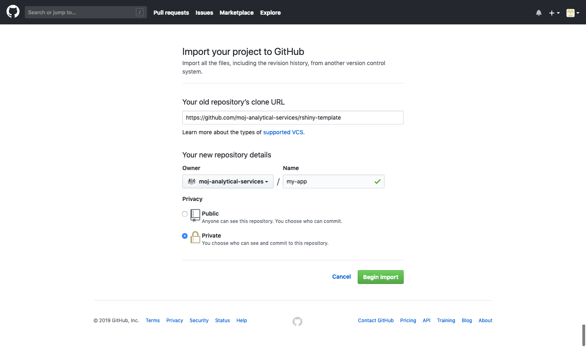

# Deploy an R Shiny app

## Basic deployment

### Summary

To create and deploy a Shiny app, you should complete the following steps:

1.  [Copy the app template](#copy-template).
2.  [Create a new webapp](#create-webapp).
3.  [Clone the repository](#clone-repo).
4.  [Develop the app](#develop-the-app).
5.  [Manage dependencies](#manage-dependencies).
6.  [Set access permissions](#rshiny-deploy).
7.  [Create a release in GitHub](#create-release).
8.  [Deploy in Concourse](#deploy-in-concourse).
9.  [Add users to the app](#add-users).
10. [Access the app](#access-the-app).

### Copy the app template{#copy-template}

To copy the app template:

1.  Go to [github.com/new/import](https://github.com/new/import).
2.  Fill in the form:
    +   Your old repository’s clone URL: `https://github.com/moj-analytical-services/rshiny-template`
    +   Owner: `moj-analytical-services`
    +   Name: The name of your app, e.g., `my-app`
    +   Privacy: Private
6.  Select __Begin import__.

This copies the entire contents of the app template to a new repository.



### Create a new webapp{#create-webapp}

Standard users are not able to create new webapps or webapp data sources themselves.

To create a new webapp or webapp data source, ask the Analytical Platform team on the [#ap_admin_request](https://asdslack.slack.com/messages/CBLAGCQG6/) Slack channel or by [email](mailto:analytical_platform@digital.justice.gov.uk), if you are a Quantum user.

You should provide the URL of the app's GitHub repository as well as any existing webapp data sources it should be connected to.

### Clone the repository{#clone-repo}

To clone the repository:

1.  Navigate to the app's repository on GitHub.
2.  Select __Clone or download__.
3.  Ensure that the dialogue says 'Clone with SSH'. If the dialogue says 'Clone with HTTPS' select __Use SSH__.
4.  Copy the SSH URL. This should start with `git@`.
5.  In RStudio, select __File__ > __New project...__ > __Version control__ > __Git__.
7.  Paste the SSH URL in the __Repository URL__ field.
8.  Select __Create Project__.


### Develop the app{#develop-the-app}

Develop the app in RStudio.

Your app can take one of several forms:

1.  A directory containing `server.R`, plus, either `ui.R` or a www directory that contains the file `index.html`.
2.  A directory containing `app.R`.
3.  An `.R` file containing an R Shiny application, ending with an expression that produces an R Shiny app object.
4.  A list with `ui` and `server` components.
5.  an R Shiny app object created by `shinyApp`.

By default, the template contains `server.R` and `ui.R` files, however, you may wish to take a different approach depending on your requirements. For example, using `app.R`, it is possible to deploy R Shiny apps from within a package, as [here](https://github.com/RobinL/costmodelr/blob/b328902026bd1cce5d17b487e310c59725ea4d62/R/shiny_explorer.r#L20).

### Manage dependencies{#manage-dependencies}

Most apps will have dependencies on various third-party packages (e.g., `dplyr`). These packages change through time and may not always be backwards compatible. To avoid compatibility issues and ensure reproducible outputs, it is necessary to use a package management system, such as packrat or Conda.

If using packrat, ensure that it is enabled for your project in RStudio.

To enable packrat, select __Tools__ > __Project Options...__ > __Packrat__ > __Use packrat with this project__.

When packrat is enabled, run `packrat::snapshot()` to generate a list of packages used in the project, their sources and their current versions.

You may also wish to run `packrat::clean()` to remove unused packages from the list.

The list is stored in a file called `packrat/packrat.lock`. You must ensure that you have committed this file to GitHub before deploying your app.

### Set access permissions{#rshiny-deploy}

You can set some access permissions for your app in the `deploy.json` file that is included with the app template. This file is used by Concourse to detect apps that are ready to build and deploy.

The `allowed_ip_ranges` parameter controls where your app can be accessed from. It can take any combination of the following values `["DOM1", "QUANTUM", "102PF Wifi"]` or `["Any"]`.

The `disable_authentication` parameter controls whether sign-in (using a link or one-time passcode sent to an authorised email address) is required for users to access the app. It can take the values `true` or `false`. In general, this should be set to `false`.

When `disable_authentication` is set to `true`, users do not need to go through a sign-in process but can still only access an app using a system specified in `allowed_ip_ranges`. This is a relatively weak security measure, as discussed [here](https://ministryofjustice.github.io/security-guidance/standards/authentication/#ip-addresses). As such, if you wish to disable authentication, you should first discuss this with the Analytical Platform team.

### Create a release in GitHub{#create-release}

When you're ready to share your app, you should create a release in GitHub. When you create a release, this is detected by Concourse, which will automatically begin the build/deploy process for your app. Each time you create a new release, Concourse will create a new build.

To create a release in GitHub:

1.  Navigate to the app's repository.
2.  Select __release__ > __Draft a new release__.
3.  Choose a tag version for the release -- GitHub provides tagging suggestions at the right of the screen that we advise you to follow.
4.  Choose a title for the release.
5.  Describe the contents of the release.
6.  Select __Publish release__.

### Deploy in Concourse{#deploy-in-concourse}

Once you have created a release in GitHub, Concourse should automatically start to deploy your app within a few minutes.

If your app does not deploy automatically, you should first check that the pipeline is not paused.

If the app still does not deploy automatically, you can manually trigger a build by pressing the `+` icon in the top right corner of Concourse.

For more information about using Concourse, see Section \@ref(build-and-deploy).

### Add users to the app{#add-users}

If `disable_authentication` is set to `false` in the `deploy.json` file, access to the app will be controlled by email address. You can ask the Analytical Platform team to add or remove users to the access list on the [#ap_admin_request](https://asdslack.slack.com/messages/CBLAGCQG6/) Slack channel or by [email](mailto:analytical_platform@digital.justice.gov.uk), if you are a Quantum user.

### Access the app{#access-the-app}

Your deployed app can be accessed at `repository-name.apps.alpha.mojanalytics.xyz`, where `repository-name` is the name of the relevant GitHub repository.

If the repository name contains underscores, these will be converted to dashes in the app URL. For example, an app with a repository called `repository_name` would have the URL `repository-name.apps.alpha.mojanalytics.xyz`.

When accessing an app, you can choose whether to sign in using an email link (default) or a one-time passcode. To sign in with a one-time passcode, add `/login?method=code` to the end of the app's URL e.g. https://kpi-s3-proxy.apps.alpha.mojanalytics.xyz/login?method=code. (This requires the app to have been deployed since the auth-proxy [release on 30/1/19](https://github.com/ministryofjustice/analytics-platform-auth-proxy/releases/tag/v0.1.8).)

## Advanced deployment

### Editing the Dockerfile

A `Dockerfile` is a text document that contains all the commands a user could call on the command line to assemble an image.

In most cases, you will not need to change the `Dockerfile` when deploying your app.

If your app uses packages that have additional system dependencies, you will need to add these in the `Dockerfile`. If you are unsure how to do this, contact the Analytical Platform team.

A `Dockerfile` reference can be found [here](https://docs.docker.com/engine/reference/builder/).

## Troubleshooting

### Common errors

Sometimes, an R Shiny app can deploy successfully but result in the following error:
```{bash error, eval=FALSE}
An error has occurred
The application failed to start

The application exited during initialization
```
This is generic error that means there is an error in your R code or there are missing packages.

To try to fix this you should:

*   explicitly reference all third-party packages using the double colon operator (i.e. use `shiny::hr()` as opposed to `hr()`)
*   ensure that you have called `packrat::snapshot()` and committed `packrat.lock` to GitHub, if using `packrat`

In general, it is also good practice to:

*   minimise the number of packages you use in your project
*   test your app early and often
*   test using a cloned copy of the app's repository to avoid issues arising as a result of uncomitted local changes

### App sign-in

Some anti-virus software and spam filters pre-click links in emails, meaning that app sign-in links do work. In this case, you should sign in using a one-time passcode, as described in Section \@ref(access-the-app).

### Packrat

If you are having issues with `packrat.lock`, follow the steps below:

1.  Delete the entire `packrat` directory.
2.  Comment out all code in the project.
3.  Enable packrat using `packrat::init()`.
4.  Capture all package dependencies using `packrat::snapshot()`.
5.  Uncomment all code in the project and install package dependencies one by one.
5.  Rerun `packrat::snapshot()`.
6.  Redeploy the app.

### Kibana

All logs from deployed apps can be viewed in [Kibana](https://kibana.services.alpha.mojanalytics.xyz).

To view all app logs:

1.  Select __Discover__ from the left sidebar.
2.  Select __Open__ from the menu bar.
3.  Select __Application logs (alpha)__ from the saved searches.

To view the logs for a specific app:

1.  Select __Add a filter__.
2.  Select __app_name__ as the field.
3.  Select __is__ as the operator.
4.  Insert the app name followed by '-webapp' as the value.
5.  Select __Save__.

Log messages are displayed in the __message__ column.

By default, Kibana only shows logs for the last 15 minutes. If no logs are available for that time range, you will receive the warning 'No results match your search criteria'.

To change the time range, select the clock icon in the menu bar. There are several presets or you can define a custom time range.

Kibana also has experimental autocomplete and simple syntax tools that you can use to build custom searches. To enable these features, select __Options___ from within the search bar, then toggle __Turn on query features__.

### Deploying locally

If you have a MacBook, you can use Docker locally to test and troubleshoot your R Shiny app. You can download Docker Desktop for Mac [here](https://hub.docker.com/editions/community/docker-ce-desktop-mac).

To build and run your R Shiny app locally, follow the steps below:

1.  Clone your app's repository to a new folder on your MacBook -- this guarantees that the app will be built using the same code as on the Analytical Platform.
2.  Open a terminal session and navigate to the directory containing the `Dockerfile` using the `cd` command.
3.  Build the Docker image by running:
    ```{bash docker build, eval=FALSE}
    docker build . -t <image tag>
    ```
    where `image tag` is a tag you want to give the image.
4.  Run a Docker container created from the Docker image by running:
    ```{bash docker run, eval=FALSE}
    docker run -p 80:80 <image tag>
    ```
5.  Go to [127.0.0.1:80](127.0.0.1:80) to view the app.

If the app does not work, follow the steps below to troubleshoot it:

1.  Start a bash session in a Docker container created from the Docker image by running:
    ```{bash docker bash run, eval=FALSE}
    docker run -it -p 80:80 <image tag> bash
    ```
2.  Install the `nano` text editor by running:
    ```{bash install nano, eval=FALSE}
    apt-get update
    apt-get install nano
    ```
3.  Open `shiny-server.conf` in the `nano` text editor by running:
    ```{bash open conf, eval=FALSE}
    nano /etc/shiny-server/shiny-server.conf
    ```
4.  Add the following lines at the beginning of `shiny-server.conf`:
    ```{bash add lines, eval=FALSE}
    access_log /var/log/shiny-server/access.log tiny;
    preserve_logs true;
    ```
5.  Write the changes by pressing `Ctrl+O`.
6.  Exit the `nano` text editor by pressing `Ctrl+X`.
7.  Increase the verbosity of logging and start the Shiny server by running:
    ```{bash increase verbosity, eval=FALSE}
    export SHINY_LOG_LEVEL=TRACE
    /bin/shiny-server.sh
    ```
8.  Open a new terminal session.
9.  Start a new bash session in the Docker container by running:
    ```{bash run bash, eval=FALSE}
    docker exec -it <CONTAINER ID> bash
    ```
    You can find the `CONTAINER ID` by running `docker ps`.
10. View the logs by running:
    ```{bash view logs, eval=FALSE}
    cat /var/log/shiny-server/access.log
    ```
    
For further details, see the [Shiny server documentation](https://docs.rstudio.com/shiny-server/).
