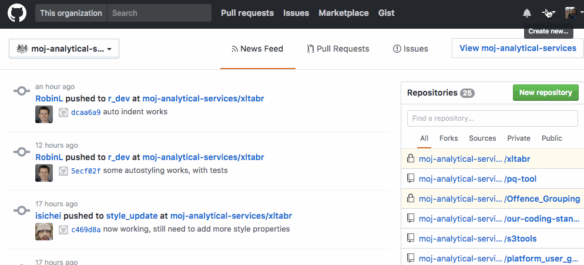
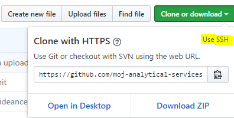
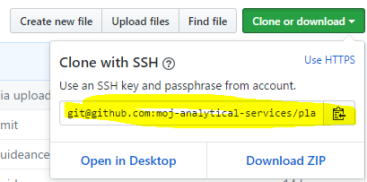
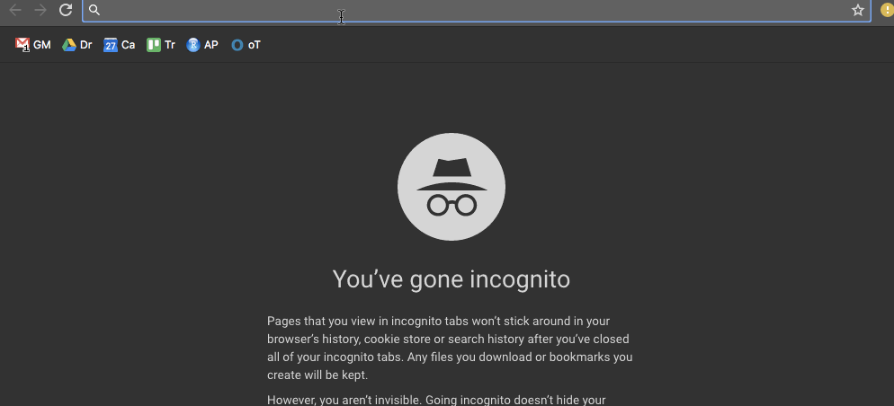

# Deploy a Static Web App

The following steps to deploy a static HTML web site are as follows:

1. Copy the [template project](https://github.com/moj-analytical-services/webapp-template) within Github to a new repository, with a name of your choice.
2. Work on your static website - the exposed content will be in the `www/` directory and `www/index.html` will be the landing page.
3. When you're ready to share it, access the [services control panel](https://jenkins.services.alpha.mojanalytics.xyz/), find your app, and click 'Build now'. This will prepare your site for deployment.
4. Set the desired access permissions in `deploy.json` (i.e. whether it should be available for DOM1, Quantum, or external).
5. When you're ready to share it, in GitHub create a 'release' and it will deploy in a few minutes.
6. Ask the Platform team to add and remove users from your app in the [#ap_admin_request](https://asdslack.slack.com/messages/CBLAGCQG6/) Slack channel.

Step-by-step instructions are below.

## Step-by-step guide to depolying an static web app

### Copy the template project into a new Github repository

1. Begin by making a **copy** of the [template project](https://github.com/moj-analytical-services/webapp-template) on Github: https://github.com/new/import

2. Enter `https://github.com/moj-analytical-services/webapp-template` in the input box entitled 'your old repository’s clone URL:'

3. Ensure the 'owner' of the new repository is 'moj-analytical-services' and choose a name for your repository:

4. Make sure the repo is 'private' (this should be the default value):

5. Click 'Begin import'

   

### In your chosen development enviroment, clone the git repository

You can find the clone link on the Github repository.

To download a copy to start editing on your local machine, you need to 'clone' the repositry. If you're using a shell: `git clone git@github.com:moj-analytical-services/YOUR-REPO-NAME.git`

#### Further notes if you're having trouble finding your new repo's url

If you navigate to your new repository's home page (which will have a url in the form `https://github.com/moj-analytical-services/your_name_goes_here`), you can use the following buttons to access this url (make sure you click the 'ssh' button):

### Work on your web app

Work on your web app using your chosen development enviroment. As you work, commit your changes to Github using your chosen Github workflow.

### Scan organisation and deploy

Include a `deploy.json` file so that Concourse will automatically build and deploy your app, so that it is running and customers can access it. For more about this see: [Build and deploy guidance](https://moj-analytical-services.github.io/platform_user_guidance/build-and-deploy.html)

### Grant secure access to the app

To grant access to someone, in the [Control Panel's Wepapps tag](https://cpanel-master.services.dev.mojanalytics.xyz/#Webapps) find your App and click "Manage App". In the 'App customers' section you can let people view your app by putting one or more email addresses in the text box and clicking "Add customer".

You can also let anyone access it by setting `"disable_authentication": true` in the `deploy.json` and redeploying it - see above.

**Note** that users can only access the app from a computer on a specified corporate network. These are defined in the `deploy.json` under the parameter `allowed_ip_ranges` - see below.

#### deploy.json

| parameter | notes |
| --------- | ------- |
| `allowed_ip_ranges` | e.g. `["DOM1", "QUANTUM", "102PF Wifi"]` or `["Any"]`|
| `disable_authentication` | To let anyone access the app, set this to `true`, otherwise `false` restricts it to people authorized for the app in the Control Panel |

If you deployed with authentication enabled users are granted access to the app using a list of email addresses separated with a space, comma or semicolon.

Changes to deploy.json only take effect when committed to GitHub, a Release is created and the deploy is successful (see [Scan organisation and deploy][Scan organisation and deploy])

## Accessing the app

Depending on the `disable_authentication` setting, the website will either be available directly or authenticated via email. The URL for the app will be the `respository-name` followed by `apps.alpha.mojanalytics.xyz`.

So for the example project above "static-web-deploy", the deployment URL will be `https://static-web-deploy.apps.alpha.mojanalytics.xyz`.

Note that characters that are not compatible with website URLs are converted. So, repositories with underscores in their name (e.g. `repository_name.apps...`) will be converted to dashes for the URL (e.g. `repository_name.apps...`).

## Advanced deployment

This section contains guidance for advanced users on app deployment.

### Can I change my build?

Yes - if you know Docker, you are welcome to change the
[Dockerfile](https://github.com/moj-analytical-services/webapp-template/blob/master/Dockerfile).
